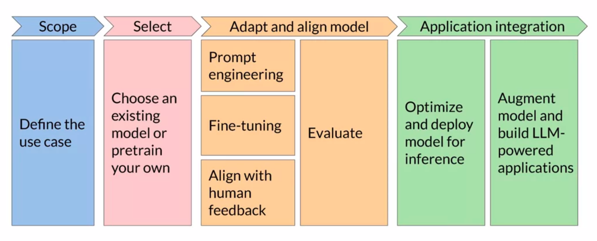
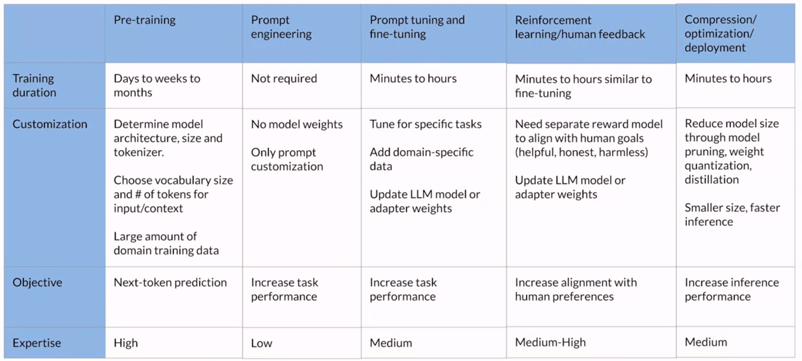

# Introduction

- [Introduction](#introduction)
  - [Generative AI](#generative-ai)
  - [LLMs](#llms)
    - [Definition](#definition)
    - [Examples (Foundation/Base Models)](#examples-foundationbase-models)
    - [Use Cases](#use-cases)
    - [Terminology](#terminology)
      - [Prompt](#prompt)
      - [Context Window](#context-window)
      - [Completion](#completion)
  - [Generative AI Project Lifecycle](#generative-ai-project-lifecycle)
    - [Overall Lifecycle](#overall-lifecycle)
    - [Steps in the Lifecycle](#steps-in-the-lifecycle)
      - [Scope](#scope)
      - [Select](#select)
      - [Adapt and Align Model](#adapt-and-align-model)
      - [Application Integration](#application-integration)
    - [Cheat Sheet](#cheat-sheet)

## Generative AI

It is a subset of traditional ML. The ML algorithms that work behind generative AI do so by exploiting the statistical patterns present in the massive datasets of content that was originally generated by humans.

## LLMs

### Definition

[LLMs](https://en.wikipedia.org/wiki/Large_language_model) (**Large Language Models**) are generative AI models specifically designed to understand text. All LLMs are powered by the [Transformer (Google, 2017)](https://arxiv.org/pdf/1706.03762.pdf) architecture. They are designed to take in input text and repeatedly generate the next token or word that appropriately "completes" the input text. For example, an LLM can be given the input:

> Where is Ganymede located in the solar system?

In response, the LLM might generate the following output:

> Ganymede is a moon of Jupiter and is located in the solar system within Jupiter's orbit.

Here, the model essentially completed the given input by repeatedly generating the next word or token that fits appropriately.

These models have abilities beyond just language and are capable of breaking down complex tasks, reasoning and problem solving.

It is commonly accepted that as the size (in terms of number of parameters) of an LLM increases, so does its understanding of language. At the same time, it is also true the smaller models can be fine-tuned to perform well on specific tasks.

### Examples (Foundation/Base Models)

- [BERT (Google, 2018)](https://arxiv.org/pdf/1810.04805.pdf)
- [GPT (OpenAI, 2018)](https://s3-us-west-2.amazonaws.com/openai-assets/research-covers/language-unsupervised/language_understanding_paper.pdf)
- [BLOOM (BigScience Warehouse, 2022)](https://arxiv.org/pdf/2211.05100.pdf)
- [FLAN-T5 (Google, 2023)](https://arxiv.org/pdf/2210.11416.pdf)
- [PaLM (Google, 2022)](https://arxiv.org/pdf/2204.02311.pdf)
- [LLaMA (Facebook, 2023)](https://arxiv.org/pdf/2302.13971.pdf)

### Use Cases

- Chatbots.
- Text summary (articles, files).
- Translation (traditional human language to human language, or from natural language to code).
- Named Entity Recognition.
- More complex tasks which require invoking external tools (answering fact-based queries using Google's Search API).

### Terminology

#### Prompt

The input given to an LLM is called the **prompt**.

#### Context Window

The space/memory that is available to the prompt is called the **context window**. It is essentially the maximum size of the prompt that the model can handle before it performs poorly. It is limited to a few thousand of words but also varies model to model.

#### Completion

The output of the an LLM when given a prompt is called the **completion**. Generally, the completion consists of the prompt and the text generated by the model by repeatedly generating the next token or word, though almost all applications omit the prompt from the model's output when showing it to users.

## Generative AI Project Lifecycle

### Overall Lifecycle

1. **Scope** - Define the use case of your application.
2. **Select** - Choose an existing model or pretrain your own.
3. **Adapt and align model** - Prompt engineering, fine-tuning, align with human feedback and evaluate.
4. **Application integration** - Optimize and deploy model for inference, and augment model and build LLM-powered applications.

### Steps in the Lifecycle

#### Scope

We need to define the scope of the project as accurately and as narrowly as we can. LLMs are capable of carrying out various tasks but their ability is dependent by their size and architecture. We need to think about the function(s) that the LLM will have in our application.

For example, do we need the model to be able to carry out many different tasks such as long-form text generation for different prompts; or do we need the model to be good at a single task such as NER.

Being specific about what the application needs to do can save us time and more importantly, help us save on compute cost.

#### Select

We need to decide whether we want to train our own model from scratch or work with an existing base model.

In general, we start with a base model except in a few cases where it might be necessary to train our own model.

#### Adapt and Align Model

We need to evaluate the performance of our model and carry out additional training as needed.

Sometimes, prompt engineering could be enough to get our model to perform well. Thus, in general, we'd start with trying |ICL), providing examples suitable for our task(s) in the prompt.

There are cases where the model may not perform as well as we need even with ICL. In those cases, we can try fine-tuning the model on some dataset specific to our task, using a supervised learning.

Additionally, to ensure the model responds naturally and safely (no racism, no harmful advice, etc), we might also need to align the model with human feedback. This is achieved through Reinforcement Learning With Human Feedback (RLHF).

All these techniques work on basis of good evaluation. If we are unable to evaluate the performance gains/losses due to these techniques, they are not useful.

For example, we can start with prompt engineering and then evaluating the model's performance. We can then use fine-tuning to improve the model's performance, and then revisit and evaluate prompt engineering one more time to get the performance we need.

#### Application Integration

Once we have a performant model which satisfies our requirements, we integrate it with the application.

An important step is to optimize the model for deployment. This will ensure that we are making the best use of our compute resources and provide the best experience for our users.

Finally, we need to consider any additional infrastructure that might be required by our LLM. For example, LLMs have a tendency to invent information when they don't know an answer, or are incapable of carrying out complex reasoning and doing mathematics. There are some powerful techniques available that can help us overcome or at least reduce the impact of these limitations.

### Cheat Sheet

The below diagram details the lifecycle in terms of time and effort required.

