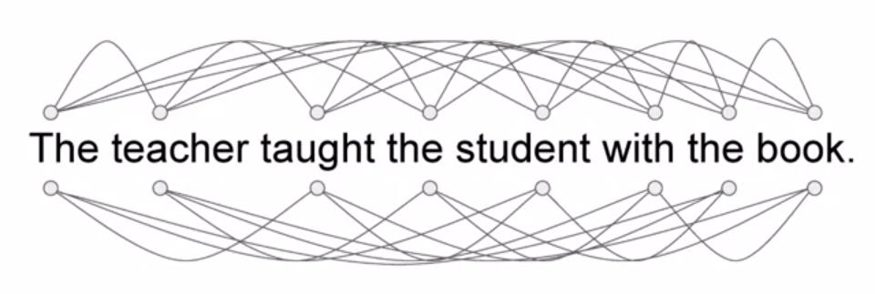
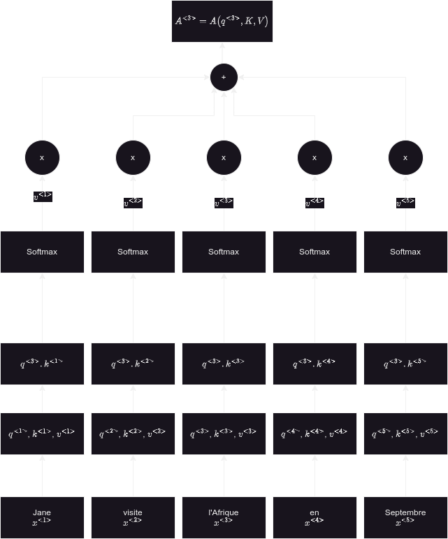
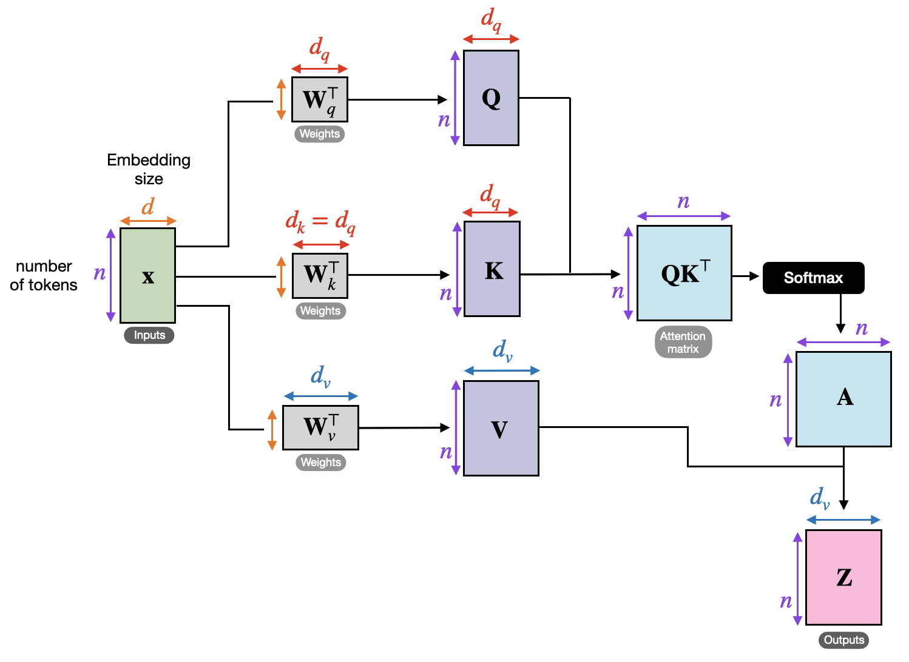
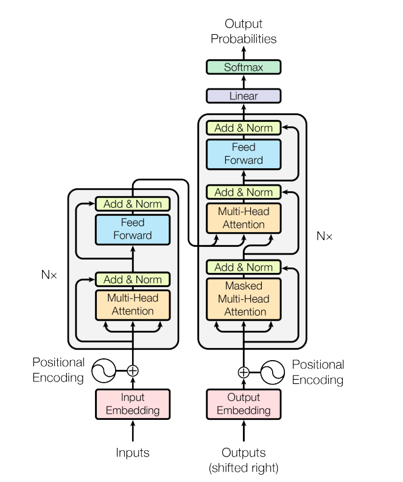
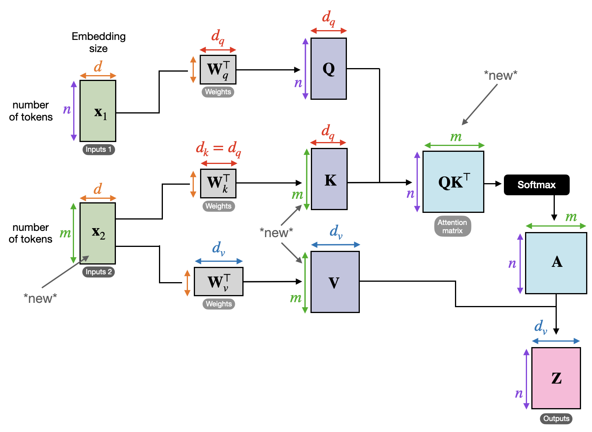

# Transformers

- [Transformers](#transformers)
  - [Before Transformers](#before-transformers)
  - [Why Transformers?](#why-transformers)
  - [Some Features of Transformers](#some-features-of-transformers)
  - [Key Concepts](#key-concepts)
    - [Self-Attention](#self-attention)
      - [Intuition](#intuition)
      - [Computation](#computation)
    - [Multi-Headed Attention](#multi-headed-attention)
      - [Intuition](#intuition-1)
      - [Computation](#computation-1)
      - [Code (PyTorch)](#code-pytorch)
    - [Positional Encoding](#positional-encoding)
      - [Why?](#why)
      - [Computation](#computation-2)
  - [Full Encoder-Decoder Architecture](#full-encoder-decoder-architecture)
    - [Encoder](#encoder)
      - [Residual Connections](#residual-connections)
      - [Layer Normalization](#layer-normalization)
      - [Feed-Forward Neural Network (FFNN)](#feed-forward-neural-network-ffnn)
    - [Decoder](#decoder)
      - [Masked Multi-Headed Attention](#masked-multi-headed-attention)
      - [Cross-Attention](#cross-attention)
      - [Linear + Softmax - Prediction](#linear--softmax---prediction)
        - [Greedy Sampling](#greedy-sampling)
        - [Random Sampling](#random-sampling)
  - [Types of Configurations of Transformers](#types-of-configurations-of-transformers)
    - [Encoder-only Models](#encoder-only-models)
    - [Encoder-Decoder Models](#encoder-decoder-models)
    - [Decoder-only Models](#decoder-only-models)
  - [Useful Resources](#useful-resources)

## Before Transformers

Text generation is not a new paradigm. Before Transformers, text generation was carried out by Recurrent Neural Networks (RNNs).

RNNs were capable at their time, but were limited by the amount of compute and memory needed to perform generative tasks.

For example, consider an RNN trained for next-token generation. By default, it can only look at the previous word and as such the model is not very good. As we scale the model to look at a greater number of previous words, we also need to significantly scale the resources required to train the model.

## Why Transformers?

To predict the next token, models need to see more than just the previous word. Models need to have an understanding of the whole input prompt. Language is complex and full of ambiguity. For example, consider the sentence:

> I took my money to the bank.

The word _bank_ is a homonym which has multiple meanings. It is only with the context of _money_ that we understand that this _bank_ refers to a financial institution and not the bank of a river. Consider another example:

> The teacher taught the student with the book.

Does the book used belong to only the teacher, only the student or both of them have a copy of the book with them?

These kind of problems are solved (to an extent, of course) by Transformers.

## Some Features of Transformers

- Can scale efficiently to use multi-core GPUs.
- Can parallel-process input data, allowing the use of massive datasets efficiently.
- Pay "attention" to the input meaning, allowing for better models which can generate more meaningful and relevant text.

## Key Concepts

### Self-Attention

#### Intuition

The power of the Transformer architecture lies in its ability to learn the relevance and context of _all_ of the words in the prompt with each other. The context is learnt not just with their immediate neighbour, but with every other word.



For example, in the above image, the model learns how the word _teacher_ is associated with every other word - _The_, _taught_, _the_, _student_, etc.

The model applies "attention weights" to the relationships so that it learns the relevance of each word to every other word. These "attention weights" are learned during training.

This is called **self-attention**. The term originates from the fact that each word in the prompt attends to other words in the same prompt, including itself. This mechanism is what enables Transformers to capture relationships and dependencies between words regardless of their distance from each other in the prompt.

#### Computation

This self-attention is computed as follows for each word $t$ in the prompt:

$$
A(q^{\langle t \rangle}, K, V) = \sum_{i}\frac{\exp(q^{\langle t \rangle}.K^{\langle i \rangle})}{\sum_{j}\exp(q^{\langle t \rangle}.K^{\langle j \rangle})}V^{\langle i \rangle}
$$

This is essentially a **softmax** over the quantity $q^{\langle t \rangle}.K^{\langle i \rangle}$.

For each word $t$, we have three values:

- $q^{\langle t \rangle}$ - Query
- $k^{\langle t \rangle}$ - Key
- $v^{\langle t \rangle}$ - Value

Corresponding to the queries, keys and values, we have three weight matrices that are learnt during training:

- $q^{\langle t \rangle} = W_Q.x^{\langle t \rangle}$
- $k^{\langle t \rangle} = W_K.x^{\langle t \rangle}$
- $v^{\langle t \rangle} = W_V.x^{\langle t \rangle}$

The terms query, key and value derived from DBMS. Intuitively, $q^{\langle t \rangle}$ allows us to ask a question for the word $t$ and the product $q^{\langle t \rangle}.k^{\langle j \rangle}$ tells us how good of an answer is word $j$ for the question.

Consider the sentence (in the context of machine translation):

>Jane visite l'Afrique en Septembre

The computation graph for the word _l'Afrique_ is as shown:



The steps are as follows:

- The dot product of $q^{\langle 3 \rangle}$ with each word's $k^{\langle t \rangle}$ is computed.
- A softmax is taken over this dot product.
- Each word's $v^{\langle t \rangle}$ is multiplied with the softmax output.
- The result is summed _element-wise_ and gives the final $A^{\langle 3 \rangle}$ value.

> [!NOTE]
> This shows that a word does not have a fixed representation and can actually adapt to how it is used in the sentence.

Overall:

- We feed $X \in R^{L \times d}$ to the network, where $L$ is the context window length and $d$ is the dimensions of the embedding.
- We project $X$ into three matrices $Q$, $K$ and $V$:
  - $Q = (W_QX^T)^T = XW_Q^T \in R^{L \times d_K}$, where $W_Q$ is a matrix of dimension $d_K \times d$.
  - $K = (W_KX^T)^T = XW_K^T \in R^{L \times d_K}$, where $W_K$ is a matrix of dimension $d_K \times d$.
  - $V = (W_VX^T)^T = XW_V^T \in R^{L \times d_V}$, where $W_V$ is a matrix of dimension $d_V \times d$.
- We compute the attention using the following vectorized equation:
 $$A(Q, K, V) = \text{softmax}(\frac{QK^T}{\sqrt{d_K}})V \in R^{L \times d_V}$$

> [!NOTE]
> $W_Q$ and $W_K$ need to have the same dimension since we take a dot product between $Q$ and $K$.

> [!NOTE]
> The output dimension depends on the dimension of $W_V$.

$\sqrt{d_K}$ is used to prevent the dot product from becoming too large. This is called the **scaled dot-product attention**.

See the image below for a full picture of the dimensions:



### Multi-Headed Attention

#### Intuition

Multi-Headed Attention is essentially a for-loop over self-attention. Intuitively, we have multiple questions we'd like to find the best answer for.

While the implementation differs for efficiency reasons, there are essentially $h$ number of $W_Q$, $W_K$ and $W_V$ matrices, one for each question we'd like to answer. $h$ is called the number of heads.

Self-attention is computed with each of these matrices, to obtain an $L \times h \times d_V$ matrix. The $h$ and $d_V$ dimensions are concatenated to get an $L \times h.d_V$ matrix. This is finally multiplied with an $d_O \times h.d_V$ matrix $W_O$ to obtain the final output of dimension $L \times d_O$.

#### Computation

The idea is to stack all the weight matrices required for computing the $Q$, $K$ and $V$ matrices for each head into one single matrix. This ensures that we can obtain the $Q$, $K$ and $V$ matrices using a single matrix multiplication instead of multiple multiplications.

Consider that each $Q$, $K$ and $V$ matrix will have $d_Q = d_K = d_V = d_h$ (say). Suppose we have $h$ number of heads. Thus, we need $3.h$ number of $d_h \times d$ matrices ($3$ for $Q$, $K$ and $V$, and $h$ for each head). In other words, we need a $3.h.d_h \times d$ matrix, where $3.h.d_h$ represents the stacked matrix dimension. Let this matrix be $W$.

We then multiply $X \in R^{L \times d}$ with $W$ as follows:

$$
\text{QKV} = (WX^T)^T = XW^T \in R^{L \times 3.h.d_h}
$$

We then reshape this to obtain an $L \times h \times 3.d_h$ tensor. Finally, we can take chunks of three from the last dimension to obtain $3$ $L \times h \times d_h$ matrices, each representing the $Q$, $K$ and $V$ matrices.

These three matrices are passed to the self-attention block to obtain an $L \times h \times d_h$ output, which is concatenated along the last dimension to obtain the $L \times h.d_h$ output $A$. Finally, $A$ is multiplied with an $h.d_h \times h.d_h$ ($d_O = h.d_h$) matrix $W_O$ to obtain the final $L \times h.d_h$ output as follows:

$$
O = (W_OA^T) = AW_O^T \in R^{L \times h.d_h = d_O}
$$

In the actual implementation, we pass in three inputs:

- $d$ - Input embedding size.
- $h$ - Number of heads.
- $d_O$ - Expected output dimension of multi-headed attention.

From this, $d_h$ is computed as $d_h = \frac{d_O}{h}$ since $d_O = h.d_h$. In other words, $d_O$ should be such that $d_O \bmod h = 0$. The rest is the same as above.

#### Code (PyTorch)

```python
import math

import torch
import torch.nn as nn
import torch.nn.functional as F


def scaled_dot_product(q, k, v, mask=None):
    d_k = q.size()[-1]
    attn_logits = torch.matmul(q, k.transpose(-2, -1))
    attn_logits = attn_logits / math.sqrt(d_k)
    # Applying mask for masked multi-headed attention
    if mask is not None:
        attn_logits = attn_logits.masked_fill(mask == 0, -9e15)
    attention = F.softmax(attn_logits, dim=-1)
    values = torch.matmul(attention, v)
    return values, attention


def expand_mask(mask):
    assert (
        mask.ndim > 2
    ), "Mask must be at least 2-dimensional with seq_length x seq_length"
    if mask.ndim == 3:
        mask = mask.unsqueeze(1)
    while mask.ndim < 4:
        mask = mask.unsqueeze(0)
    return mask


class MultiheadAttention(nn.Module):
    def __init__(self, d, dO, h):
        super().__init__()
        assert dO % h == 0, "Embedding dimension must be 0 modulo number of heads."

        self.dO = dO
        self.h = h
        # Compute dh
        self.dh = dO // h

        # Create the stacked weight matrix using a linear layer
        # It will receive a d-dim input
        # And produce a 3.h.dh = 3.dO dimensional output
        self.qkv_proj = nn.Linear(d, 3 * dO)

        # Create WO using a linear layer
        # It will receive an h.dh = dO-dim input and
        # Produce a dO-dim output
        self.o_proj = nn.Linear(dO, dO)

        self._reset_parameters()

    def _reset_parameters(self):
        # Original Transformer initialization, see PyTorch documentation
        nn.init.xavier_uniform_(self.qkv_proj.weight)
        self.qkv_proj.bias.data.fill_(0)
        nn.init.xavier_uniform_(self.o_proj.weight)
        self.o_proj.bias.data.fill_(0)

    def forward(self, x, mask=None, return_attention=False):
        batch_size, seq_length, _ = x.size()

        if mask is not None:
            mask = expand_mask(mask)

        # [Batch, L, 3*h.dh] = [Batch, L, 3.dO]
        qkv = self.qkv_proj(x)

        # Reshape to [Batch, L, h, 3*dh]
        qkv = qkv.reshape(batch_size, seq_length, self.h, 3 * self.dh)
        # Permute as [Batch, h, L, 3*dh]
        qkv = qkv.permute(0, 2, 1, 3)
        # Take out [Batch, h, L, dh] chunks to obtain Q, K and V
        q, k, v = qkv.chunk(3, dim=-1)

        # Apply self-attention - [Batch, h, L, dh]
        values, attention = scaled_dot_product(q, k, v, mask=mask)
        # Permute to [Batch, L, h, dh]
        values = values.permute(0, 2, 1, 3)
        # Concatenate to [Batch, L, h.dh] = [Batch, L, dO]
        values = values.reshape(batch_size, seq_length, self.dO)
        # Multiply with WO for final output
        o = self.o_proj(values)

  return (o, attention) if return_attention else o
```

### Positional Encoding

#### Why?

Multi-headed attention has no information about the relative position of words in the input sequence. But, position can be extremely important in a sentence. Thus, transformers have a positional encoding step.

#### Computation

The position is encoded using the following function:

$$
\text{PE}(t, i) = \begin{cases}
 \sin(\frac{t}{10000^{2k/d}}), & i = 2k \\
 \cos(\frac{t}{10000^{2k/d}}), & i = 2k + 1 \\
\end{cases}
$$

where $t$ ($1 \leq t \leq L$) is the numerical position of the word being encoded and $i$ ($0 \leq i < d$) is an index into the embedding for the word.

Take the sentence:

> Jane visite l'Afrique en Septembre

Consider the word _Jane_. Here, $t = 1$. Assuming 4-dimensional embedding ($0 \leq i \leq 3$), the positional encoding of _Jane_ would be:

$$[\sin(1), \cos(1), \sin(\frac{1}{\sqrt{1000})}), \cos(\frac{1}{\sqrt{10000}})]
$$

since $\text{PE}(1, 0) = \sin(1)$, $\text{PE}(1, 1) = \cos(1)$, $\text{PE}(1, 2) = \sin(\frac{1}{\sqrt{1000})})$ and $\text{PE}(1, 3) = \cos(\frac{1}{\sqrt{10000}})$ respectively.

This creates a vector with alternating sine and cosine waves, which have different frequencies. This vector is added to the original embedding for the word so that the original embedding also has information about the word's position.

## Full Encoder-Decoder Architecture



The Transformer is an encoder-decoder architecture. Both the encoder and decoder blocks are repeated $N$ times. Typically, $N = 6$.

The working of the encoder and decoder is explained below (in the context of machine translation).

### Encoder

The parts (expect multi-headed attention) in the encoder are detailed below.

#### Residual Connections

The output matrix of the multi-headed attention is added to the original embedded input using a residual connection.

> [!NOTE]
> This requires the output dimension of the multi-headed attention layer to match the original dimension of the input. In other words, $d_O = d$ so that the output is $L \times d$.

This residual connection is important since:

- It helps with the depth of the model by allowing information to be passed across greater depths.
- Multi-headed attention does not have any information about the position of tokens in the input sequence. With the residual connection (and [[#Positional Encoding|positional encoding]]), it is possible to pass this information to the rest of the model instead of the information being lost after the first multi-headed attention pass. It gives the model a chance to distinguish which information came from which element of the input sequence.

#### Layer Normalization

A layer normalization is applied to the added output. This is preferred over batch normalization since the batch size is often small and batch normalization tends to perform poorly with text since words tend to have a high variance (due to rare words being considered for a good distribution estimate).

Layer normalization:

- Speeds up training.
- Provides a small regularization.
- Ensures features are in a similar magnitude among the elements in the input sequence.

#### Feed-Forward Neural Network (FFNN)

The normalized output is fed to an FFNN. It is applied to each element in the input sequence separately and identically. The encoder uses a Linear $\rightarrow$ ReLU $\rightarrow$ Linear model. Usually, the inner dimension of the FFNN is 2-8 $\times$ larger than $d$, the size of the input embedding.

The FFNN adds complexity to the model and can be thought of as an extra step of "pre-processing" applied on the output of multi-headed attention.

There is also a residual connection between the output of the multi-headed attention and the output of the FFNN, with layer normalization.

### Decoder

The decoder is basically the same as the encoder but there are two things that are important to note in the decoder.

#### Masked Multi-Headed Attention

The first multi-headed attention layer uses masking during training. This allows parallel training.

During training, we have the entire expected output sequence. Thus, we do not need to predict word by word. We can instead feed the entire output sequence to the decoder.

To ensure that it still behaves as if its predicting one word at a time, a part of the $L \times L$ matrix that is obtained after computing $\frac{QK^T}{\sqrt{d_K}}$ is masked. In particular, a word at index $i$ should only attend to words from indices $1$ to $i$. Thus, all indices from $i + 1$ to $L$ are set to $-\infty$ so that they become $0$ when the softmax is applied. Consider the sentence:

> Je suis un étudiant

After computing $\frac{QK^T}{\sqrt{d_K}}$ and applying softmax, the matrix might look like this:

|  | _Je_ | _suis_ | _un_ | _étudiant_ |
|---|---|---|---|---|
| _Je_ | $1$ | $0$ | $0$ | $0$ |
| _suis_ | $0.02$ | $0.98$ | $0$ | $0$ |
| _un_ | $0.05$ | $0.20$ | $0.75$ | $0$ |
| _étudiant_ | $0.38$ | $0.02$ | $0.05$ | $0.55$ |

For _suis_, $i = 2$. Thus, the elements at indices $(2, 3)$ and $(2, 4)$ are $0$ since _suis_ should attend only to _Je_ and _suis_ itself. On the other hand, the word _étudiant_ should attend to all the words since its the last word. Thus, no element in that row is $0$.

> [!NOTE]
> The output is shifted to the right **during inference**, where we do not have the entire output sequence and are actually predicting one word at a time. We start the decoder with the single token `<SOS>` as the input and then, as the decoder predicts the next word, we add this new word to the input. This is what's referred to as "shifted right" in the diagram.

#### Cross-Attention

Cross-attention is a generalization of self-attention.

In self-attention, we are computing the attention matrix for a single sequence. The same sequence is used to compute the $Q$, $K$ and $V$ matrices.

In cross-attention, we have two different sequences $x_1$ and $x_2$. $x_1$ is used to compute the $Q$ matrix while $x_2$ is used to compute the $K$ and $V$ matrices. When $x_1 = x_2$, cross-attention reduces to self-attention.

In the decoder, cross-attention is used in the second multi-headed attention layer. The $Q$ matrix comes from the output of the first multi-headed attention layer, which is turn uses the input to the decoder as its input. The $K$ and $V$ matrices are computed from the output of the final encoder block.

In essence, the input to the decoder is acting as $x_1$ and the output of the final encoder block is acting as $x_2$.

Cross-attention can work with sequences of different lengths. When computing $Q$ from $x_1$, we get an $L_1 \times d_Q$ matrix. When computing $K$ from $x_2$, we get an $L_2 \times d_Q$ matrix. When we take the dot product of $Q$ and $K$, we get an $L_1 \times L_2$ matrix. Since $V$ is also computed from $x_2$, its dimension is $L_2 \times d_V$. Thus, the overall result of cross-attention will be $L_1 \times d_V$ after softmax and multiplying with $V$. See the image below ($L_1 = n$ and $L_2 = m$):



> [!NOTE]
> This technique of cross-attention is also used in diffusion models. See [High-Resolution Image Synthesis with Latent Diffusion Models](https://arxiv.org/pdf/2112.10752.pdf).

#### Linear + Softmax - Prediction

There is a final linear layer followed by a softmax activation. This converts the output of the decoder to a probability distribution over all the words. In other words, if the dictionary of words has $N$ words, this layer has $N$ units, for each word.

The next word can be predicted from this probability distribution by either taking the one with the maximum probability or using other techniques. These other techniques can affect how creative the model is. For example, technique might lead to the model not choosing the most "obvious" word every time and going for slightly eccentric choices.

##### Greedy Sampling

The technique of using the word with the maximum probability is called **greedy sampling**. This is the most commonly used technique for many models. Consider the following softmax output:

| Probability | Word |
|---|---|
| $0.20$ | cake |
| $0.10$ | donut |
| $0.02$ | banana |
| $0.01$ | apple |
| $\dots$ | $\dots$ |

The model would output the word _cake_ since it has the highest probability.

##### Random Sampling

Another approach is called **random-weighted sampling**. It introduces some variability to the model's output. Instead of taking the word with the maximum probability, the probabilities are used as weights to sample one word at random.

For example, consider the following softmax output:

| Probability | Word |
|---|---|
| $0.20$ | cake |
| $0.10$ | donut |
| $0.02$ | banana |
| $0.01$ | apple |
| $\dots$ | $\dots$ |

The word _cake_ has a 20% chance of being selected while the word _banana_ has a 2% chance of being selected. It might be that the model selects the word _banana_.

It is possible that this technique leads to the model becoming too creative, where it generates words or wanders into topics that do not make sense with respect to the prompt.

## Types of Configurations of Transformers

### Encoder-only Models

They only have encoders. Without some changes, these models always produce an output which is of the same length as the input sequence.

It is possible to modify these so that they can be used for tasks such as semantic classification.

> **Example**: BERT.

### Encoder-Decoder Models

This is the model originally described in the Transformers paper and the one detailed here. The output sequence and the input sequence can be of different lengths.

It is useful for sequence-to-sequence tasks such as machine translation.

> **Example**: BART, FLAN-T5.

### Decoder-only Models

These are some of the most commonly used models. As they have scaled, they have gained the ability to generalize to pretty much any task.

> **Example**: GPT, BLOOM, LLaMA.

## Useful Resources

- Transformers paper - [Attention Is All You Need](https://arxiv.org/pdf/1706.03762.pdf).
- [Understanding and Coding the Self-Attention Mechanism of Large Language Models From Scratch](https://sebastianraschka.com/blog/2023/self-attention-from-scratch.html).
- [Tutorial 6: Transformers and Multi-Head Attention](https://uvadlc-notebooks.readthedocs.io/en/latest/tutorial_notebooks/tutorial6/Transformers_and_MHAttention.html).
- [Lecture on Transformers from the Course](https://www.coursera.org/learn/generative-ai-with-llms/lecture/3AqWI/transformers-architecture).
- [Lectures on Transformers from Deep Learning Specialization's Sequence Model course on Coursera](https://www.coursera.org/learn/nlp-sequence-models/home/week/4).
- [Layer Normalization](https://www.pinecone.io/learn/batch-layer-normalization/#What-is-Layer-Normalization).
