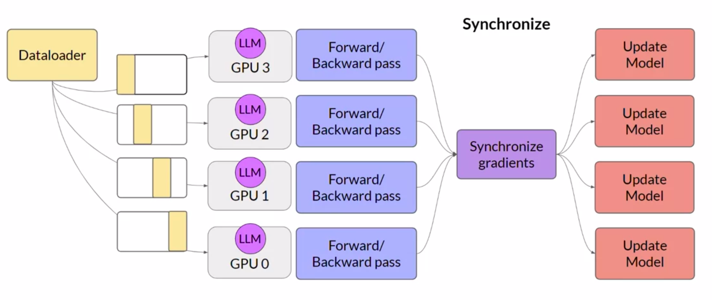
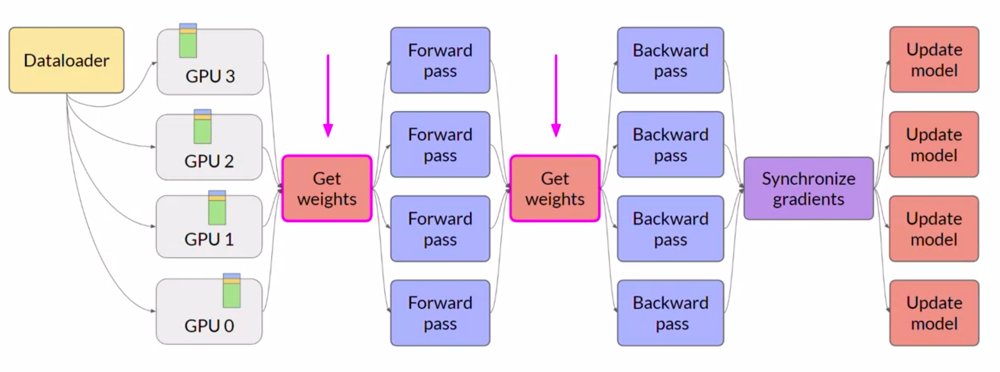
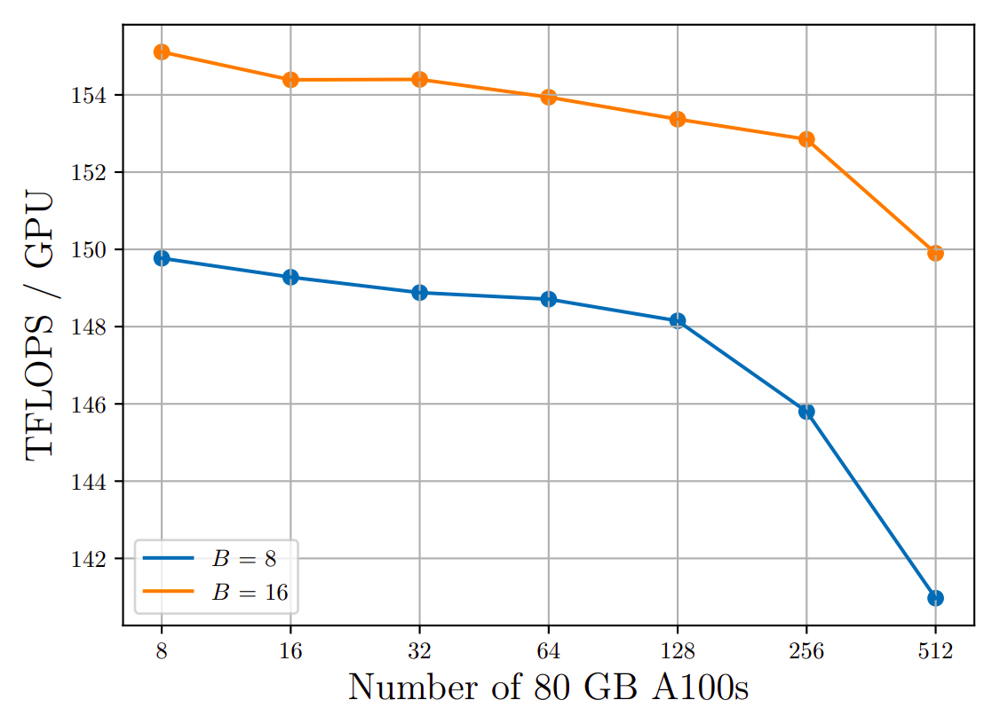

# Efficient Multi-GPU Compute Strategies

- [Efficient Multi-GPU Compute Strategies](#efficient-multi-gpu-compute-strategies)
  - [When to Use?](#when-to-use)
  - [Strategies](#strategies)
    - [PyTorch's Distributed Data Parallel (DDP)](#pytorchs-distributed-data-parallel-ddp)
    - [PyTorch's Fully Sharded Data Parallel (FSDP)](#pytorchs-fully-sharded-data-parallel-fsdp)
  - [Useful References](#useful-references)

## When to Use?

While multiple GPUs are a must when the model is too big to fit on a single GPU, they can be applicable even when the model fits on the GPU since then, we can train the model in parallel by feeding multiple training examples in parallel.

## Strategies

### PyTorch's Distributed Data Parallel (DDP)

DDP is applicable when the model weights _and_ all the additional parameters, gradients, optimizer states, etc., fit on a single GPU. It's a way to train an LLM using parallelism.

It works as follows:

- The model is copied to different GPUs.
- At the same time, different batches of data are copied to the GPUs and each batch is processed in parallel (both forward and backward pass).
- At the end, there is a step to synchronize the gradients from each of the GPUs.
- These synchronized gradients are used to update the model weights on each of the GPUs, which are always _identical_.

DDP clearly allows for much faster training since we are training on multiple examples in parallel.

### PyTorch's Fully Sharded Data Parallel (FSDP)

Model sharding is the general technique used to train models that cannot fit on a single GPU.

FSDP is an implementation of model sharding, inspired by the paper _[ZeRO: Memory Optimizations Toward Training Trillion Parameter Models](https://arxiv.org/pdf/1910.02054.pdf)_ (Microsoft, 2019).

ZeRO stands for Zero Redundancy Optimizer. The goal of ZeRO is to optimize memory by distributing or sharding model states (weights, optimizer states, gradients, etc.) across GPUs with zero data overlap.

Consider using the Adam optimizer on an LLM. The memory requirement looks as follows:

|  | Memory (bytes/parameter) |
|---|---|
| Model Parameters | 4 |
| Adam Optimizer (2 states) | 8 |
| Gradients | 4 |
| Activations and temp memory (variable sized) | 8 (overestimate) |
| Total | 24 |

In case of DDP, a full copy of the model is stored on each GPU. In other words, every GPU will be consuming 24 bytes/parameter and will store the same numbers. Thus, there is redundant memory consumption.

ZeRO eliminates this redundancy by distributing (sharding, instead of replicating) model parameters, gradients and optimizer states across GPUs. It also ensures that the communication overhead stays close to that in DDP.

ZeRO offers three strategies for optimization:

- **Stage 1**: Only the optimizer states are sharded across GPUs. It can reduce memory usage by up to a factor of 4.
- **Stage 2**: The gradients as well as the optimizer states are shared across GPUs. It can reduce memory usage by up to a factor of 8.
- **Stage 3**: The model parameters, gradients _and_ optimizer states are sharded across GPUs. With Stage 1 and Stage 2, memory reduction is linear with the number of GPUs. That is, sharding across 64 GPUs _could_ reduce memory by up to a factor of 64.

FSDP works as follows:

- In addition to sharding the training data, it also shards the model parameters, gradients and optimizer states across multiple GPUs, using one of the strategies specified in the ZeRO paper.
- In DDP, each GPU has all the model states to process each batch of data available locally. FSDP collects this data from all the GPUs before the forward and backward passes. Each CPU requests data from the other GPUs on-demand to materialize the shared data into unsharded data for the duration of the operation.
- After the operation, the unsharded non-local data is released back to the other GPUs as original sharded data. We can optionally choose to keep it for future operations, such as those in the backward pass. Storing them would require more VRAM.
- After the backward pass, FSDP synchronizes the gradients across the GPUs in the same way as DDP and updates the model.

It helps reduce overall GPU memory utilization and also supports offloading part of the training workload to the CPU, if needed.

It clearly introduces performance overheads, which can be controlled by specifying the level of sharding, called the **sharding factor**. If the sharding factor is set to 1, the sharding is removed and the model is replicated to the GPUs, similar to DDP (**full replication, no sharding**). If sharding factor is set to the maximum number of GPUs, we want to shard as much as possible (**full sharding**). Anything in between is **hybrid sharding**.

Note that according to _[PyTorch FSDP: Experiences on Scaling Fully Sharded Data Parallel](https://arxiv.org/pdf/2304.11277.pdf)_ (Meta AI, 2023), as the model size increases and it is sharded across more and more GPUs, the amount of overhead due to the communication between GPUs starts becoming more and more significant and reduces the performance of individual GPUs.

## Useful References

- [GETTING STARTED WITH DISTRIBUTED DATA PARALLEL](https://pytorch.org/tutorials/intermediate/ddp_tutorial.html).
- [DISTRIBUTED DATA PARALLEL IN PYTORCH - VIDEO TUTORIALS](https://pytorch.org/tutorials/beginner/ddp_series_intro.html?utm_source=youtube&utm_medium=organic_social&utm_campaign=tutorial).
- [GETTING STARTED WITH FULLY SHARDED DATA PARALLEL(FSDP)](https://pytorch.org/tutorials/intermediate/FSDP_tutorial.html).
- [PyTorch FSDP Tutorials](https://www.youtube.com/playlist?list=PL_lsbAsL_o2BT6aerEKgIoufVD_fodnuT).
