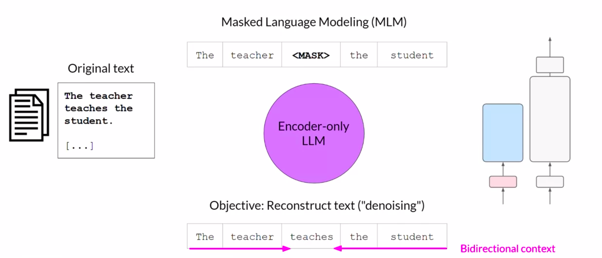
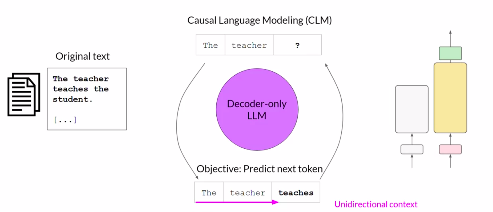
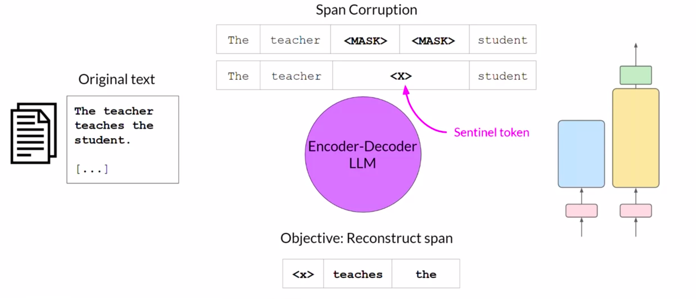
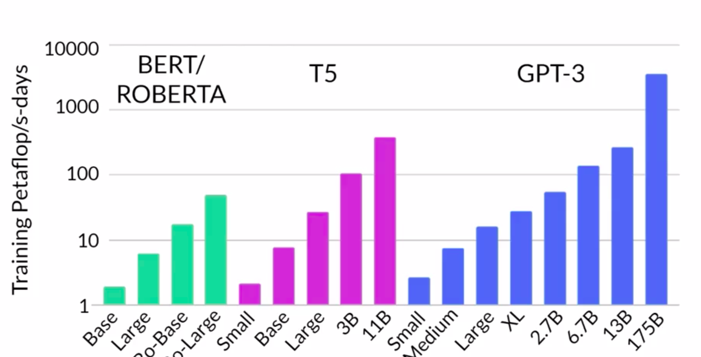
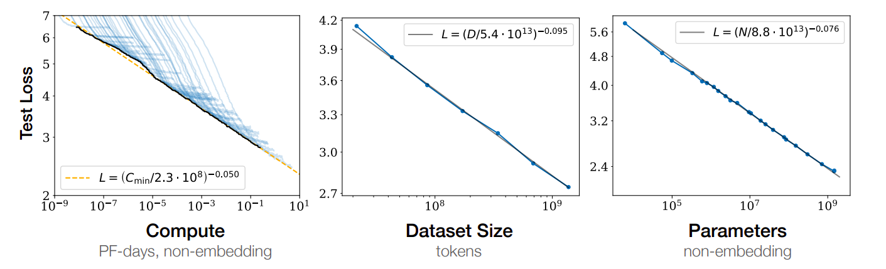
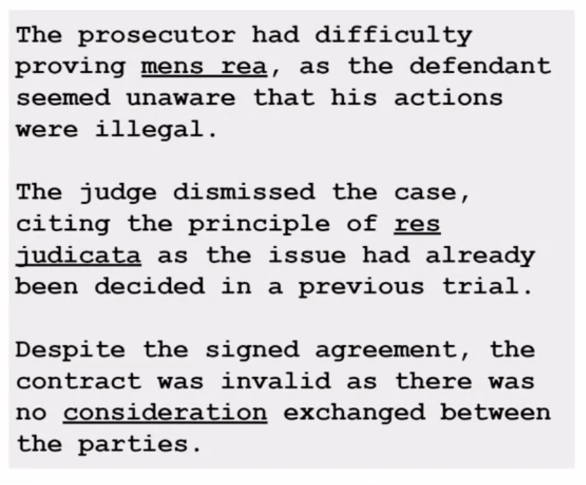
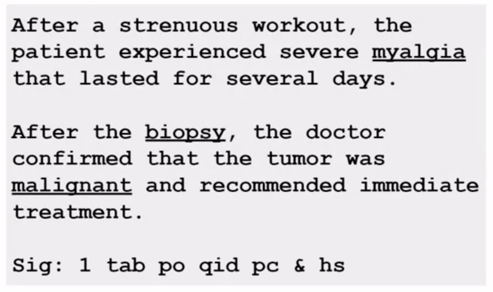

# Pre-Training Large Language Models

- [Pre-Training Large Language Models](#pre-training-large-language-models)
  - [Choosing a Model](#choosing-a-model)
    - [Model Hubs](#model-hubs)
  - [Training Large Language Models](#training-large-language-models)
    - [Initial Training Process (Pre-training)](#initial-training-process-pre-training)
    - [Training Objectives for Transformer Variants](#training-objectives-for-transformer-variants)
      - [Encoder-only Models (Autoencoding Models)](#encoder-only-models-autoencoding-models)
      - [Decoder-only Models (Autoregressive Models)](#decoder-only-models-autoregressive-models)
      - [Encoder-Decoder Models (Sequence-to-Sequence Models)](#encoder-decoder-models-sequence-to-sequence-models)
  - [Computational Challenges in Training LLMs](#computational-challenges-in-training-llms)
    - [Quantization](#quantization)
      - [FP16 and BF16](#fp16-and-bf16)
      - [INT8](#int8)
  - [Scaling Choices](#scaling-choices)
  - [Compute Budget](#compute-budget)
    - [Petaflops/s-day](#petaflopss-day)
    - [Compute Budget, Dataset Size, Model Size vs Model Performance](#compute-budget-dataset-size-model-size-vs-model-performance)
    - [Compute-Optimal Models](#compute-optimal-models)
  - [Domain Adaptation](#domain-adaptation)
    - [Introduction](#introduction)
    - [Examples](#examples)
      - [Legal Domain](#legal-domain)
      - [Medical Domain](#medical-domain)
    - [Case Study - BloombergGPT - Domain Adaptation for Finance](#case-study---bloomberggpt---domain-adaptation-for-finance)

## Choosing a Model

After figuring out the scope of our application, the next step is to select the model we will work with.

We have two options:

1. Choose a pre-trained foundation model.
2. Train our own model to create a custom LLM.

There are specific use cases where the second option might make more sense but in general, we will develop our application using a pre-trained foundation model.

### Model Hubs

There are many open-source and paid models available that we can use for our application.

Many of the developers of these models have made available "hubs" where we can browse and test the models.

One of the most useful features of these hubs is the inclusion of **model cards**. Model cards describe important details of a model such as the best use case of the model, how it was trained and its limitation.

Example: Model card for LLaMa: [Model Card](https://github.com/facebookresearch/llama/blob/main/MODEL_CARD.md).

## Training Large Language Models

Variants of the Transformer model are suited to different tasks.

The differences in these variants can be understood by taking a look at how these variants are trained. This, in turn, can help us make an informed decision regarding the model we want to use for our application by helping us better navigate model hubs.

### Initial Training Process (Pre-training)

The initial training process of an LLM is called as **pre-training**. LLMs work by learning a deep statistical representation of language and this deep representation is developed during pre-training.

At a high-level, during pre-training, the model is fed large amounts of unstructured textual data, ranging from gigabytes to petabytes in size. The data is pulled from many sources such as web crawling and corpora of text compiled specifically to train LLMs.

The pre-training process is **self-supervised**. The model internalizes the patterns and structures present in the language. These patterns then unable the model to complete its training objective, which depends on the architecture of the model. In other words, during pre-training, the model weights get updated to minimize the loss of training objective.

Clearly, this step requires a lot of compute and the use of GPUs.

Additionally, since the data is coming from public sources such as the internet, there is often a data quality filter applied before feeding the data to the LLM so that the training data is of high quality, has low bias and does not have harmful content. Due to this, only about 1-3% of the original tokens are used for pre-training.

### Training Objectives for Transformer Variants

The [three configurations](../Introduction%20and%20Generative%20AI%20Project%20Lifecycle/Transformers.md#Types%20of%20Configurations%20of%20Transformers) of a Transformer are trained with different training objectives and thus, learn to perform different tasks.

#### Encoder-only Models (Autoencoding Models)

The encoder-only variants of Transformers are also called **autoencoding models**.

They are pre-trained using **Masked Language Modeling (MLM)**. In MLM, tokens in the input sequence are randomly masked and the training objective is to predict the masked tokens in order to reconstruct the original input sequence. This is also called a **denoising objective** since the masking of the tokens can be thought of as adding noise to the input sequence and then predicting the masked tokens can be thought of as removing that noise from the input sequence.

Autoencoding models build **bidirectional context** representations of the input sequence, meaning that model has an understanding of the full context of the token rather than just the tokens that come before it.

These models are usually suited to tasks that benefit from this bidirectional context such as sentiment analysis, named entity recognition and word classification, etc.

> Examples: BERT, ROBERTA.

#### Decoder-only Models (Autoregressive Models)

The decoder-only variants of Transformers are also called **autoregressive models**.

They are pre-trained using **Causal Language Modeling (CLM)**. In CLM, the training objective is to predict the next token based on the previous sequence of tokens. The tokens of the input sequence are masked and the model can only see the input tokens leading up to the token being predicted at the moment. The model has no knowledge of the tokens that come after this token. The model then iterates over the input sequence one-by-one to predict the next token. Thus, in contrast to autoencoding models, the model builds a **unidirectional context** for each token.

By learning to predict the next token from a vast number of examples, the model builds a statistical representation of the language. Predicting the next token is sometimes called **full language modeling** by researchers.

These mode,ls are most suitable for text generation but large autoregressive models also show strong zero-shot inference ability and can perform a variety of tasks.

> Examples: GPT, BLOOM.

#### Encoder-Decoder Models (Sequence-to-Sequence Models)

The encoder-decoder variants of Transformers are also called **sequence-to-sequence models**.

The exact details of pre-training objective vary from model to model. For example, FLAN-T5 is trained using **span corruption**. In span corruption, a part of the input sequence is masked and replaced by a sentinel token. These sentinel tokens are special tokens added to the vocabulary that to do not correspond to any actual word from the dataset. The decoder then has to reconstruct the sentence autoregressively. The output is the sentinel token followed by the predicted tokens.

We can use such models for tasks such as translation, summarization and question answering. They are most useful where the input and output both are bodies of text.

> Examples: FLAN-T5, BART.

## Computational Challenges in Training LLMs

LLMs have a lot of parameters and thus, require vast compute resources for training.

One common issue is memory. Many models are too big to be loaded into a single GPU's memory. We can encounter an `OutOfMemoryError` when we try to do so.

Consider an LLM with 1 billion parameters. All parameters are stored as floats and using single-precision, each parameter occupies 32 bits or 4 bytes. 1 billion parameters would require $4 \times 10^9$ bytes or ~4 GB. Thus, we need a GPU with at least 4 GB of VRAM to even load the model.

On top of that, to train the model at 32-bit full precision, we need an additional ~80 GB of VRAM. 80 GB is the VRAM capacity of a single NVIDIA A100 GPU.

There is a popular technique to reduce memory usage.

### Quantization

We reduce the amount of memory required to store and train the model by reducing the precision from 32-bit floating point (**FP32**) numbers to 16-bit floating point numbers (**FP16**) or 8-bit integers (**INT8**) for the model.

The range of values that can be represented by FP32 is from ~$-3 \times 10^{-38}$ to ~$3 \times 10^{38}$, and FP32 is the default representation for the model.

Quantization *statistically* projects the 32-bit numbers into a lower precision space, using scaling factors calculated based on the range  of the original 32-bit floating point numbers.

> Example: Consider that we want to store $\pi$ to 6 decimal places, that is we want to store $\pi = 3.141592$.

#### FP16 and BF16

This is stored as $0 \; 10000000 \; 10010010000111111011000$ in 32-bit representation. The first bit is the sign bit, the next 8 bits represent the exponent and the final 23 bits represent the fraction/mantissa/significand.

The last 23 bits decide the precision of the representation. If we convert this to decimal and compare it to the real value of $\pi$, we'll see that the converted number has lost precision. But the number is accurate in the 6 decimal places we require.

The same number is projected as $0 \; 10000 \; 1001001000$ in 16-bit representation. While there is a sign bit like 32-bit, there are only 5 bits for the exponent and only 10 bits for the fraction. This makes the range of values much smaller (~$-65504$ to ~$65504$). When we convert this, we lose even more precision, with the result being $3.140625$.

Another popular alternative in the AI field is **BFLOAT16** or **BF16**, developed by Google Brain. This has 1 sign bit, 8 exponent bits and 7 fraction bits. It's a hybrid between FP16 and FP32. It helps with training stability and is supported by NVIDIA GPUs like the A100.

BF16 is also called the *truncated FP32* since it captures the dynamic range of FP32 but still uses 16 bits. It uses the full 8 bits for the exponent like FP32 but truncates the fraction part to 7 bits. This saves memory and also increases model performance by speeding up calculations. The disadvantage is that BF16 is not well suited for integer calculations, which are anyways rare in deep learning.

#### INT8

If we project the 32-bit $\pi$ representation to INT8, it will be stored as $0 \; 0000011$. If we use one bit for the sign, there are 8 bits for the fraction. The range of values is $-128$ to $127$. $\pi$ is simply projected to $3$. The memory requirement is halved even further, for a total reduction by a factor of $\frac{1}{4}$.

But nowadays, its common for models to have 50 billion or over 100 billion parameters, requiring thousands of gigabytes of GPU memory. In such cases, we need to split the model across multiple GPUs for training (see [Efficient Multi-GPU Compute Strategies](Efficient%20Multi-GPU%20Compute%20Strategies.md)).

## Scaling Choices

The goal during pre-training an LLM is to maximize the model's performance on its learning objective.

This is equivalent to minimizing the loss function.

There are two choices to achieve better performance:

- Increasing the dataset size in terms of number of tokens.
- Increasing the model size in terms of number of parameters.

These are the scaling choices available to us.

## Compute Budget

In theory, we can scale either or both the dataset size and the model size, but we are constrained by compute budget in terms of GPUs, training time, cost, etc.

### Petaflops/s-day

There are some popular units used to measure compute budget.

One of them is the **petaflops/s-day** (PF-days). It is the number of floating point operations performed at a rate of 1 petaflop (1 quadrillion floating point operations) per second for one day.

With respect to training transformers, 1 petaflop/s-day is equivalent to about 8 NVIDIA V100 GPUs or 2 NVIDIA A100 GPUs operating at full efficiency for 24 hours.

The graph below shows the petaflops/s-day measurements for some popular models. BERT/ROBERTA are encoder-only models, T5 is an encoder-decoder model and GPT3 is a decoder-only model. The y-axis is logarithmic. The x-axis varies in terms of the number of parameters trained.

### Compute Budget, Dataset Size, Model Size vs Model Performance

Researchers have explored the relationships between dataset size, model size and compute budget.

In the paper [Scaling Laws for Neural Language Models](https://arxiv.org/pdf/2001.08361.pdf) (OpenAI, 2020), we find the following figure:

The graph shows a clear relationship between model performance and each of the three factors, which can be approximated by a **power-law relationship**. That is, one is proportional to the other raised to some power. When plotted on a graph where both axes are logarithmic, such relationships appear as a straight line. The relationship only holds when the training is not bottlenecked by the other two factors.

More often than not, compute budget is a hard constraint, determined by:

- Hardware Availability
- Project Timeline
- Financial Budget

Thus, most of the time, we end up increasing the model size or the dataset size to increase performance.

### Compute-Optimal Models

In the paper [Training Compute-Optimal Large Language Models](https://arxiv.org/pdf/2203.15556.pdf) (DeepMind, 2022, popularly referred to as the *Chinchilla paper*), researchers tried to find the optimal number of parameters and volume of training data for a given compute budget. Such models are called **compute-optimal models**.

The paper found the following:

- Very large models maybe be over-parameterized and under-trained. They have more parameters than they need to achieve a good understanding of language and they would benefit from seeing more training data.
- Smaller models trained on more data could perform as well as large models.
- Compute-optimal training dataset size is ~20 times the number of parameters.

The paper presented the Chinchilla model as a proof of their findings. The Chinchilla model uses the same compute budget as another model called [Gopher](https://arxiv.org/pdf/2203.15556.pdf), but has 4 times fewer parameters (70 billion vs 280 billion) and uses 4 times more training data. It consistently outperforms Gopher while being significantly smaller.

Due to the findings of the paper, research teams have started developing smaller models that achieve similar if not better performance than larger models trained in a non-optimal way.

## Domain Adaptation

### Introduction

Using a pre-trained LLM can help us save time and get to a working solution much faster.

However, there is a situation where it may be necessary to pre-train our own model. If the domain of the problem we are trying to solve uses vocabulary and language structures that are not commonly used in day-to-day language, we might need to train our own model.

This is called **domain adaptation**.

### Examples

#### Legal Domain

Legal language is often very different from day-to-day language and usually requires domain adaptation. For example, the usage of latin terms. Moreover, it also uses everyday words in different contexts.

#### Medical Domain

The medical domain also uses uncommon words to describe diseases. It also involves the usage of language in an idiosyncratic way, as shown in the image below. The line *Sig: 1 tab po qid pc & hs* does not make much sense to us but is actually a shorthand used by doctors to write prescriptions. It makes a lot of sense to a pharmacist.

### Case Study - BloombergGPT - Domain Adaptation for Finance

[BloombergGPT](https://arxiv.org/pdf/2303.17564.pdf) is an LLM developed by Bloomberg for the finance domain.

It was trained on data consisting of both finance data (~51%) and general-purpose text data (~49%). The model achieves best-in-class performance in finance-related tasks while also maintaining competitive performance in general language tasks.

The authors used the *Chinchilla* pre-scaling laws to guide their training.

See paper for more details.
