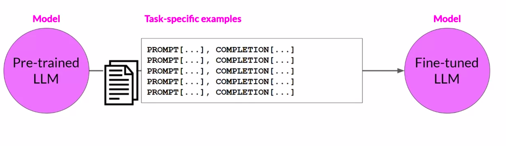
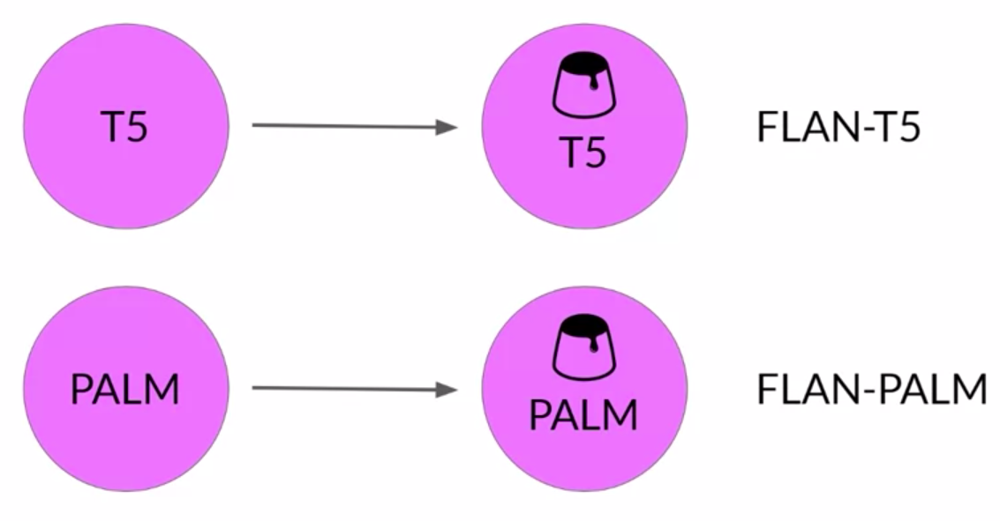
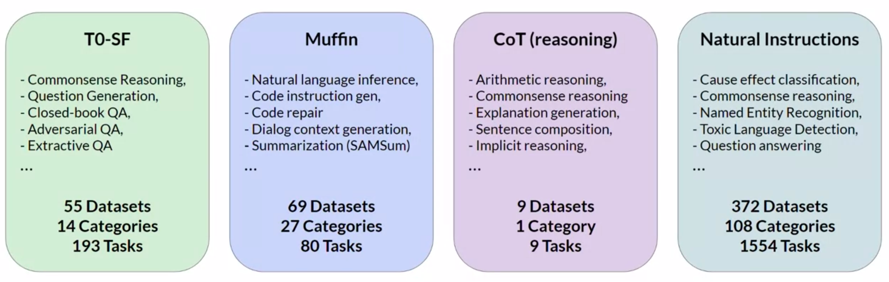
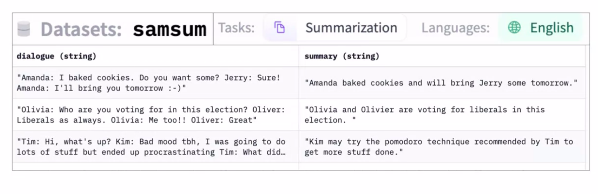

# Instruction Fine-Tuning

- [Instruction Fine-Tuning](#instruction-fine-tuning)
  - [Limitations of ICL](#limitations-of-icl)
  - [Instruction Fine-Tuning](#instruction-fine-tuning-1)
    - [Introduction](#introduction)
    - [Common Steps Involved in Instruction Fine-Tuning](#common-steps-involved-in-instruction-fine-tuning)
      - [Prepare the Dataset](#prepare-the-dataset)
      - [Split Dataset](#split-dataset)
      - [Training](#training)
  - [Fine-Tuning On a Single Task](#fine-tuning-on-a-single-task)
    - [Introduction](#introduction-1)
    - [Catastrophic Forgetting](#catastrophic-forgetting)
      - [Problem](#problem)
      - [Avoiding Catastrophic Forgetting](#avoiding-catastrophic-forgetting)
  - [Fine-Tuning On Multiple Tasks](#fine-tuning-on-multiple-tasks)
    - [Introduction](#introduction-2)
    - [Case Study - FLAN](#case-study---flan)
  - [Useful References](#useful-references)

## Limitations of ICL

We saw how some models are capable of identifying instructions contained in a prompt and correctly carrying out zero-shot inference. On the other hand, we also saw smaller models which fail to do so. In such cases, we use [In-Context Learning (ICL)](../../Week%201/Introduction%20and%20Generative%20AI%20Project%20Lifecycle/Prompting%20and%20Prompt%20Engineering.md#In-Context%20Learning%20(ICL)) to make the model follow our instructions.

There are some disadvantages to this:

- ICL may not always work for smaller models.
- Examples take up space in the context window, reducing the space available to add useful information in the prompt.

To combat these disadvantages while having a model that can follow instructions, we can use instruction fine-tuning.

## Instruction Fine-Tuning

### Introduction

Fine-tuning is the process of using **labelled data** to adapt a pre-trained model to a specific task or tasks. The data consists of prompt-completion pairs. Note that fine-tuning is applied on a pre-trained model and is **supervised**, as opposed to self-supervised.

Instruction fine-tuning is a fine-tuning technique used to improve a model's performance on a variety of tasks. Here, the training samples are prompts containing instructions while the labels are the expected response of the model in order to follow that instruction.

> **Example**: If we want to fine-tune a model to improve its summarization ability, the dataset will contain prompts which look like as follows:
>
> **Prompt**:
> Summarize the following text
> (EXAMPLE TEXT)
>
> **Completion**:
> Summarize the following text
> (EXAMPLE TEXT)
> (EXAMPLE COMPLETION)

Instruction fine-tuning where all of the model's weights are updated is called **full fine-tuning**. This results in a new version of the model with updated weights. Note that full fine-tuning requires enough memory and compute budget to store all the gradients, optimizer states and other components updated during training (see [Efficient Multi-GPU Compute Strategies](Efficient%20Multi-GPU%20Compute%20Strategies.md)).

### Common Steps Involved in Instruction Fine-Tuning

There are some common steps involved in fine-tuning.

#### Prepare the Dataset

There are many publicly available datasets that have been used to train previous generations of LLMs. Most of these datasets are _not_ formatted as instructions.

Developers have built **prompt template libraries** that can be used to take existing datasets (for example, Amazon product reviews) and turn them into instruction prompt datasets for fine-tuning.

Prompt template libraries include many templates for different tasks. For example:

Notice how each of the templates has an instruction in it: _predict the associated rating_, _generate an x-star review_ and _give a short sentence describing the following product review_.

The result is a prompt with an instruction and the example from the original dataset.

#### Split Dataset

After the dataset is prepared, like any supervised problem, we split the dataset into training, validation and test sets.

#### Training

The fine-tuning training loop is similar to any other supervised training loop:

- Pass the training data in batches to the model and obtain predictions.
- Calculate the loss. The output of an LLM is a probability distribution over the tokens available in the dataset. Thus, we can compare the probability distribution of the prediction with that of the label and use the standard cross-entropy loss to calculate the loss.
- Calculate some evaluation metric.
- Pass the validation data to the model and obtain predictions.
- Calculate the loss (optional) and the same evaluation metric.
- Backpropagate the loss to update the weights and repeat from the beginning as the next epoch.

After training is done, we can evaluate the final performance of the model by passing it the test data and measuring the evaluation metric on model predictions.

This process leads to a new version of the model, often called an **Instruct Model**. It tends to perform better at the tasks we have fine-tuned it for.

## Fine-Tuning On a Single Task

### Introduction

Fine-tuning on a single task can be done by simply using a single-task dataset. That is, all prompt-completion pairs in the dataset have the same basic instruction in them.

> **Example**:
> Summarize the following text:
> (EXAMPLE TEXT)
> (EXAMPLE COMPLETION)

In most cases, only a small dataset (500-1000 examples) is required to achieve good performance on a single-task.

### Catastrophic Forgetting

#### Problem

Fine-tuning on a single task can lead to a problem called **catastrophic forgetting**. This happens since full fine-tuning changes the weights of the original LLM. This leads to great performance on the task we are fine-tuning for but can degrade performance on other tasks.

For example, a model fine-tuned for sentiment analysis might become very good at the task, but might fail on something like named entity recognition despite being performant on it before fine-tuning.

#### Avoiding Catastrophic Forgetting

First, we have to figure out whether our model is actually impacted by the problem. For example, if we require reliable performance only on the single task we are fine-tuning for, we do not need to worry about catastrophic forgetting.

But, if we want the model to maintain its multi-task performance, we can perform fine-tuning on multiple tasks at the same time. This generally requires 50,000-100,000 examples across many tasks.

Another alternative is **Parameter Efficient Fine-Tuning (PEFT)**. PEFT preserves the weights of the original LLM and trains only a small number of task-specific adapter layers and parameters (see [Parameter Efficient Fine-Tuning (PEFT)](Parameter%20Efficient%20Fine-Tuning%20(PEFT).md)).

## Fine-Tuning On Multiple Tasks

### Introduction

In case of multiple tasks, the dataset contains prompt-completion pairs related to multiple tasks.

> **Example**:
>
> Summarize the following text:
>
> Rate this review:
>
> Translate into Python code:
>
> Identify the places:

The model is trained on this mixed dataset to fine-tune on multiple tasks simultaneously and remove the risk of catastrophic forgetting.

### Case Study - FLAN

FLAN (**F**ine-tuned **La**nguage **N**et) is a family of models fine-tuned on multiple tasks.

FLAN models refer to a specific set of instructions used to perform instruction fine-tuning.

> The metaphorical dessert to the main course of pre-training.

FLAN-T5 is the FLAN instruct version of the T5 foundation model while FLAN-PALM is the FLAN instruct version of the PALM foundation model.

FLAN-T5 is general purpose instruct model. It is fine-tuned on 473 datasets across 146 task categories. These datasets are chosen from other models and papers.

For example, the SAMSum dataset is a text summarization dataset. SAMSum has 16,000 messenger-like conversations with their summaries. They were crafted by linguists for the express purpose of training LLMs.

Below are examples of prompt templates for this dataset.

Note that while FLAN models are general-purpose, we might still need [Domain Adaptation](../../Week%201/LLM%20Pre-training%20and%20Scaling%20Laws/Pre-training%20Large%20Language%20Models.md#Domain%20Adaptation) for it to make it work well for our application.

## Useful References

- FLAN [paper](https://arxiv.org/pdf/2210.11416.pdf).
- SAMSum [paper](https://arxiv.org/pdf/1911.12237.pdf).
- DialogSum on [HuggingFace](https://huggingface.co/datasets/knkarthick/dialogsum).
