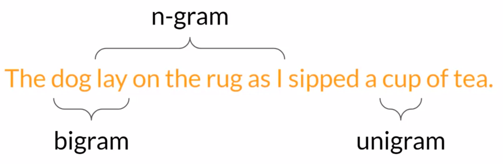

# Model Evaluation - Metrics and Benchmarks

- [Model Evaluation - Metrics and Benchmarks](#model-evaluation---metrics-and-benchmarks)
  - [Challenges in Evaluating LLMs](#challenges-in-evaluating-llms)
  - [Terminology - n-gram](#terminology---n-gram)
  - [Metrics](#metrics)
    - [ROUGE](#rouge)
      - [ROUGE-1](#rouge-1)
      - [ROUGE-2](#rouge-2)
      - [ROUGE-L](#rouge-l)
      - [ROUGE Hacking](#rouge-hacking)
    - [BLEU Score](#bleu-score)
    - [Caution](#caution)
  - [Benchmarks](#benchmarks)
    - [GLUE and SuperGLUE](#glue-and-superglue)
    - [Benchmarks for Massive Models](#benchmarks-for-massive-models)
      - [MMLU](#mmlu)
      - [BIG-Bench](#big-bench)
      - [HELM](#helm)
  - [Useful References](#useful-references)

## Challenges in Evaluating LLMs

In traditional ML, we use the accuracy score to assess how well a model performs on a given task.

$$
\text{Accuracy} = \frac{\text{Correct Predictions}}{\text{Total Predictions}}
$$
This works since the a model's output is always deterministic. That is, given the same input, the model always gives the same output.

LLMs are non-deterministic. Given the same prompt twice, an LLM is likely to produce two different responses instead of the same response. This makes plain accuracy score an inappropriate metric for evaluation.

Consider the sentence:

> Mike really loves drinking tea.

And:

> Mike adores sipping tea.

Both the sentences are similar. Now consider the sentence:

> Mike does not drink coffee.

And:

> Mike does drink coffee.

The sentences refer to two opposite things.

Thus, we need a metric that can capture the similarity between the first pair of sentences while also capturing the dissimilarity between the second pair of sentences.

## Terminology - n-gram

Before we can look at metrics used for LLMs, we need to understand what an n-gram is.

An n-gram refers to a collection of n words in a piece of text. For example, an unigram refers to a single word and a bigram refers to two words.

## Metrics

ROUGE and the BLEU Score are two widely used metrics to measure the performance of LLMs. They are used for different tasks.

### ROUGE

**ROUGE** (**R**ecall-**O**riented **U**nderstudy for **G**isting **E**valuation) is primarily used for text summarization. It compares a summary to one or more human-generated reference summaries.

#### ROUGE-1

ROUGE-1 looks at unigrams (hence the one in the name).

The score has a recall, precision and F1-score related to it.

The ROUGE-1 recall score is defined as:

$$
\text{ROUGE-1}_{recall} = \frac{\text{unigram matches}}{\text{unigrams in reference}}
$$

In other words, the recall score for ROUGE-1 measures the number of unigram matches with respect to the human reference.

The precision score is defined as:

$$
\text{ROUGE-1}_{precision} = \frac{\text{unigram matches}}{\text{unigrams in output}}
$$

The precision score measures the number of unigram matches with respect to the generated output.

Finally, the F1-score is defined as usual (harmonic mean of precision and recall):

$$
\text{ROUGE-1}_{f1} = 2\frac{\text{precision} \times \text{recall}}{\text{precision} + \text{recall}}
$$

Consider that a model outputs the following sentence:

> It is very cold outside.

Let the human reference sentence be:

> It is cold outside.

Then, the ROUGE-1 Recall score is:

$$
\text{ROUGE-1}_{recall} = \frac{4}{4} = 1.0
$$

The precision score is:

$$
\text{ROUGE-1}_{precision} = \frac{4}{5} = 0.8
$$

And the F1-score is:

$$
\text{ROUGE-1}_{f1} = 2\frac{1.0 \times 0.8}{1.0 + 0.8} = 0.89
$$

This is a very basic metric which only looks at individual words and does not consider the ordering of the words. It is easy to construct sentences that score well but are subjectively poor responses.

Consider the generated sentence:

> It is not cold outside.

There is a single word difference. The scores would be the same as the previous example but the generated output is fundamentally different in meaning to the human reference.

#### ROUGE-2

ROUGE-2 works on bigrams, looking at a collection of two words at a time.

The definition of the recall, precision and F1-scores are the same except unigrams are replaced with bigrams.

Consider the same example as before.

The bigrams for the generated sentence are:

> (It is) (is very) (very cold) (cold outside)

The bigrams for the reference sentence are:

> (It is) (is cold) (cold outside)

The recall score is:

$$
\text{ROUGE-2}_{recall} = \frac{2}{3} = 0.67
$$

The precision score is:

$$
\text{ROUGE-2}_{precision} = \frac{2}{4} = 0.50
$$

Thus, the F1-score is:

$$
\text{ROUGE-2}_{f1} = 2\frac{0.67 \times 0.50}{0.67 + 0.50} = 0.57
$$

The score is lower as compared to ROUGE-1 and as the sentence length increases, fewer and fewer bigrams are likely to match.

#### ROUGE-L

Instead of looking at n-grams with larger values of $n$, ROUGE-L finds the  longest common subsequence (LCS) between the human reference and the generated output. The LCS is computed at the word level instead of character level.

With the reference _It is cold outside_ and the generated output _It is very cold outside_, the longest common subsequences are _It is_ and _cold outside_. Thus, the LCS length is 2.

The recall score is defined as:

$$
\text{ROUGE-L}_{recall} = \frac{\text{LCS}(\text{Gen}, \text{Ref})}{\text{unigrams in reference}}
$$

The precision score is defined as:

$$
\text{ROUGE-L}_{precision} = \frac{\text{LCS}(\text{Gen}, \text{Ref})}{\text{unigrams in output}}
$$

The F1-score is defined in terms of precision and recall, as usual.

For the example, the recall score is $\text{ROUGE-L}_{recall} = \frac{2}{4} = 0.50$, the precision score is $\text{ROUGE-L}_{precision} = \frac{2}{5} = 0.40$ and the F1-score is $\text{ROUGE-L}_{f1} = 2\frac{0.50 \times 0.40}{0.50 + 0.40} = 0.44$.

> [!NOTE]
> We can use the scores to compare the capabilities of models only if the scores were determined for the same task. ROUGE scores for different tasks are not comparable.

#### ROUGE Hacking

The problem with ROUGE scores is that they can lead to high scores for bad outputs. Consider the reference _It is cold outside_ and the generated output _cold cold cold cold_. Since the generated output contains one of the words from the reference, it will score highly. For example, the ROUGE-1 precision score is going to be $\frac{4}{4} = 1.0$.

To combat this, we can use **ROUGE clipping**, which limits the number of unigram matches to the maximum count of that unigram in the reference.

$$
\text{Modified precision} = \frac{\text{clip}(\text{unigram matches})}{\text{unigrams in output}}
$$

For the example, the score is going to be $\frac{1}{4} = 0.25$ since there is only one occurrence of _cold_ in the reference and the $\text{clip}()$ function will limit the number of matches of _cold_ from $4$ to $1$. This results in a much smaller score.

There are still issues if the words are present in the generated output but in a different order. Consider the output _outside cold it is_. This will have a perfect score, even with clipping.

Thus, experimenting with an n-gram size that will calculate the most useful score will depend on the sentence, the sentence size and our use case.

### BLEU Score

BLEU (**B**i**L**ingual **E**valuation **U**nderstudy) is primarily used for machine translation. It compares a translation to human-generation translations.

The score is computed using the average precision over multiple n-gram sizes. It is similar to the ROUGE score but is calculated over a range of n-gram sizes and then averaged.

$$
\text{BLEU} = \text{avg}(\text{precision across range of n-gram sizes})
$$

Consider the human reference:

> I am very happy to say that I am drinking a warm cup of tea.

And the generated output:

> I am very happy that I am drinking a cup of tea.

The BLEU score can be calculated using HuggingFace. The score comes out as $0.495$.

With the generated output:

> I am very happy that I am drinking a warm cup of tea.

The BLEU score is $0.730$. As we get closer and closer to the human reference, the score keeps increasing and getting closer to $1$.

### Caution

These scores can be used for a simple reference as we iterate over models, but should not be used alone to report the final evaluation of an LLM. We can use them for diagnostic evaluation, but for overall evaluation, we need to use benchmarks.

## Benchmarks

Benchmarks allow comparing LLMs more holistically. We use pre-existing datasets and associated benchmarks that have been established by LLM researchers specifically for model evaluation.

Selecting the right evaluation dataset is vital in order to accurately assess an LLMs performance and understand its true capabilities. Our focus should be on selecting datasets that isolate specific model skills like reasoning and common sense knowledge, and those that focus on potential risks, such as disinformation or copyright infringement.

An important issue to consider is whether the model has seen our evaluation dataset during training. We can obtain a more accurate and useful sense of the model's abilities by evaluating its performance on data it hasn't seen before.

> **Examples**: GLUE, SuperGLUE, MMLU (Massive Multitask Language Understanding), HELM, Big-Bench.

### GLUE and SuperGLUE

GLUE (**G**eneral **L**anguage **U**nderstanding **E**valuation) is a collection of natural language tasks such as sentiment analysis and question-answering.

It is created to encourage the development of models that can generalize across multiple tasks. Thus, we can use this benchmark to measure and compare model performance.

SuperGLUE is a successor to GLUE, developed to overcome the limitations of GLUE. It includes some tasks that were not included in GLUE and also some tasks that more challenging versions of the same task.

### Benchmarks for Massive Models

As models become larger and larger, they start matching human performance on GLUE and SuperGLUE. That is, they perform at a human level on the benchmarks but subjectively, we can see that they are not performing at human level at tasks in general.

Thus, there is an arms race between the emerging capabilities of LLMs and the benchmarks that aim to measure them. Some emerging benchmarks used for modern LLMs are mentioned below.

#### MMLU

MMLU (**M**assive **M**ultitask **L**anguage **U**nderstanding) is designed for modern LLMs.

To perform well on this benchmarks, models must have extensive world knowledge and problem-solving ability. The benchmark includes task that extend beyond basic language understanding. They are tested on elementary mathematics, US history, computer science, law and many more topics.

#### BIG-Bench

BIG-Bench currently consists of 204 tasks involving linguistics, childhood development, math, common sense reasoning, biology, physics, social bias, software development and more.

It comes in three different sizes (_Lite_, _BIG-bench_, _BIG-bench Hard_) to keep costs manageable since running these large benchmarks can incur large inference costs.

#### HELM

HELM (**H**olistic **E**valuation of **L**anguage **M**odels) aims to improve the transparency of LLMs and offer guidance on which models perform well for specific tasks.

It takes a multi-metric approach, measuring seven metrics across 16 core scenarios. This ensures that trade-offs between models and metrics are clearly exposed.

Some of the metrics it measures are:

- Accuracy
- Calibration
- Robustness
- Fairness
- Bias
- Toxicity
- Efficiency

The benchmark goes beyond basic accuracy measures such as precision and F1 score. It also measures fairness, bias and toxicity, which are becoming increasingly important to assess as LLMs become more capable of human-like generation and in turn, of exhibiting potentially harmful behavior.

HELM is a _living benchmark_, meant to continuously evolve with the addition of new scenarios, metrics and models.

## Useful References

- ROUGE [paper](https://aclanthology.org/W04-1013.pdf).
- BLEU [paper](https://aclanthology.org/P02-1040.pdf).
- GLUE [paper](https://arxiv.org/pdf/1804.07461.pdf) and SuperGLUE [paper](https://arxiv.org/pdf/1911.11763.pdf).
- GLUE (and SuperGLUE) [website](https://gluebenchmark.com/).
- MMLU [paper](https://arxiv.org/pdf/2009.03300.pdf).
- BIG-Bench [paper](https://arxiv.org/pdf/2206.04615.pdf).
- HELM [paper](https://arxiv.org/pdf/2211.09110.pdf).
