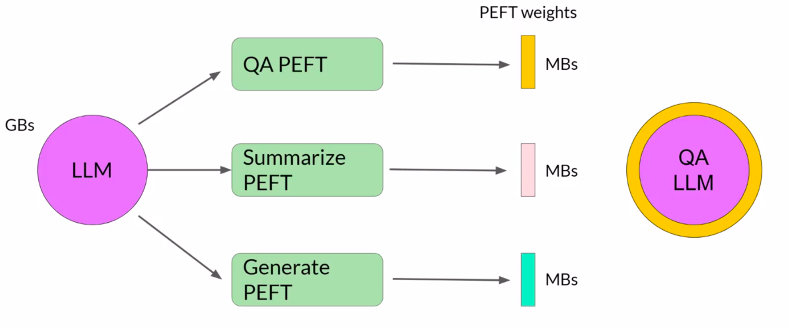
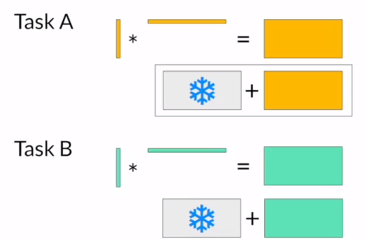
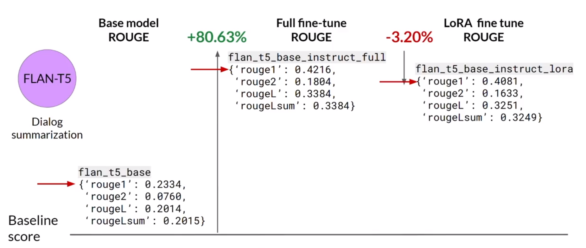
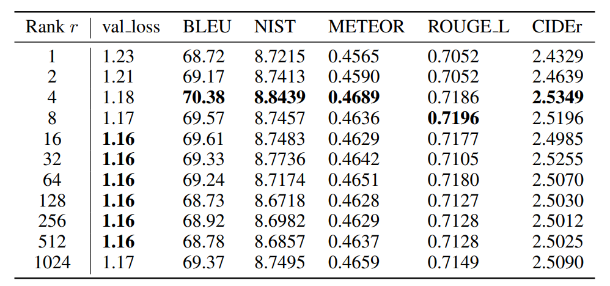
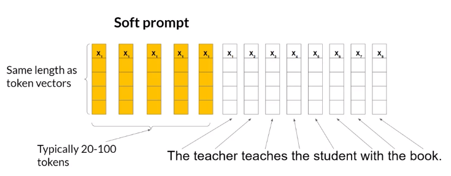
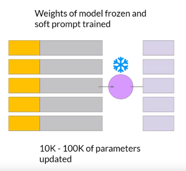
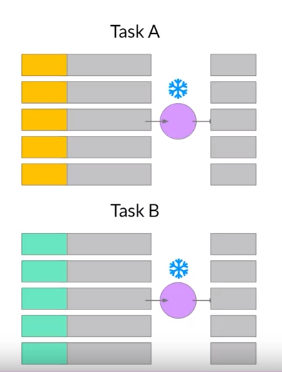
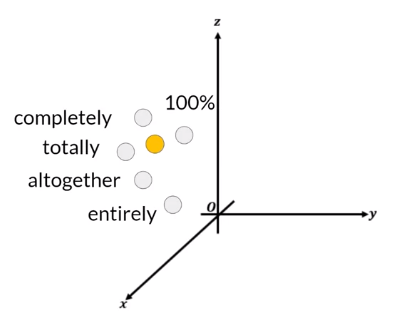

# Parameter Efficient Fine-Tuning (PEFT)

- [Parameter Efficient Fine-Tuning (PEFT)](#parameter-efficient-fine-tuning-peft)
    - [Introduction](#introduction)
    - [PEFT Methods in General](#peft-methods-in-general)
        - [Selective](#selective)
        - [Reparameterization](#reparameterization)
        - [Additive](#additive)
    - [Low Rank Adaptation (LoRA)](#low-rank-adaptation-lora)
        - [Introduction](#introduction-1)
        - [Practical Example](#practical-example)
        - [Multiple Tasks](#multiple-tasks)
        - [Base Model vs Full Fine-Tuning vs LoRA](#base-model-vs-full-fine-tuning-vs-lora)
        - [Choosing The Rank $r$](#choosing-the-rank-r)
    - [Soft Prompts](#soft-prompts)
        - [Introduction](#introduction-2)
        - [Prompt Tuning vs Full Fine-tuning](#prompt-tuning-vs-full-fine-tuning)
        - [Multiple Tasks](#multiple-tasks-1)
        - [Interpretability of Soft Prompts](#interpretability-of-soft-prompts)
    - [Useful Resources](#useful-resources)

## Introduction

Full-fine tuning of large language LLMs is challenging. Fine-tuning requires storing training weights, optimizer states, gradients, forward activations and temporary memory. Things to store other than the weights can take up to **12-20 times** more memory than the weights themselves.

In full fine-tuning, every weight of the model is updated during training.

PEFT methods only update a subset of the weights. They involve freezing most of the layers in the model and allowing only a small number of layers to be trained. Other methods don't change the weights at all and instead, add new layers to the model and train only those layers.

Due to this, the number of trainable weights is much smaller than the number of weights in the original LLM. This reduces the overall memory requirement for training, so much so that PEFT can often be performed on a single GPU.

Since most of the LLM is left unchanged, PEFT is also less prone to [Catastrophic Forgetting](Instruction%20Fine-Tuning.md#Catastrophic%20Forgetting).

PEFT weights are trained separately for each task. They are combined with the original weights of the LLM for inference. This makes them easily swappable, allowing efficient adaptation of the model to different tasks.

PEFT involves multiple trade-offs:

- Parameter Efficiency
- Training Speed
- Inference Costs
- Model Performance
- Memory Efficiency

## PEFT Methods in General

### Selective

We select a subset of initial LLM parameters to fine-tune.

There are several approaches to select which subset of parameters we want to fine-tune. We can decide to train:

- Only certain components of the model.
- Specific layers of the model.
- Individual parameter types

The performance of these approaches and the selective method overall is mixed. There are significant trade-offs in parameter efficiency and compute efficiency and hence, these methods are not very popular.

### Reparameterization

The model weights are reparameterized using a low-rank representation.

Example techniques are [Low Rank Adaptation (LoRA)](#low-rank-adaptation-lora).

### Additive

New, trainable layers or parameters are added to the model.

There are generally two methods:

- **Adapters** - New trainable layers are added to the model, typically inside the encoder or decoder blocks, after the FFNN or the attention layers.
- **Prompt Tuning** - The model architecture is kept fixed and instead, the input (prompt) is manipulated to obtain better performance. This can be done by adding trainable parameters to the prompt embeddings, or keeping the input fixed and retraining the embedding weights. Example techniques include [Soft Prompts](#soft-prompts).

## Low Rank Adaptation (LoRA)

### Introduction

LoRA is a PEFT technique based on reparameterization.

The encoder and decoder blocks of a Transformer consist of self-attention (in the form of Multi-Headed Attention) layers. Weights are applied to the input embedding vectors to obtain an attention map for the input prompt.

In full fine-tuning, every weight in these layers is updated. In LoRA:

- All the model parameters are frozen.
- Two (smaller) **rank decomposition matrices** $A$ and $B$ are injected with the original weights. The dimensions of the matrices are such that their product has the same dimension as that of the original weight matrices.
- The weights in the smaller matrices are trained via fine-tuning.

For inference:

- We multiply the two low rank matrices to obtain $B \times A$, which has the same dimensions as the frozen weights of the model.
- We add $B \times A$ to the original frozen weights.
- The model weights are replaced with these new weights.

We now have a fine-tuned model which can carry out the task(s) we have fine-tuned it for. Since the model has the same number of parameters as original, there is little to no impact on inference latency.

Researchers have found that applying LoRA just to the self-attention layers is often enough to fine-tune for a task and achieve performance gains. However, in principle, we can use LoRA in other components such as the feed-forward layers. Since most of the parameters are the model are in the attention layers, we get the biggest savings when we apply LoRA in those layers.

### Practical Example

Consider the Transformer model presented in the _Attention Is All You Need_ paper. According to the paper, the model has dimensions $d \times d_K = 512 \times 64$ in the attention layer. There are thus $32,768$ trainable parameters in the model.

If we use LoRA with rank $r = 8$:

- $A$ has dimensions $r \times d_K = 8 \times 64$, giving $512$ parameters.
- $B$ has dimensions $d \times r = 512 \times 8$, giving $4096$ trainable parameters.

$$
\text{Change} = \frac{32768 - (512 + 4096)}{32768}*100 \approx 86\%
$$

Thus, we have an 86% decrease in the number of parameters we need to train. Due to this drastic reduction in the amount of compute required, LoRA can often be performed on a single GPU.

### Multiple Tasks

LoRA also makes it easy to fine-tune a model for different tasks. We can train the model using the rank decomposition matrices for each of the tasks. This will give us a pair of $A$ and $B$ matrices for each task.

During inference, we can swap out the matrices depending on the task we want the model to do and update the weights (by adding to the frozen weights).

### Base Model vs Full Fine-Tuning vs LoRA

We can see that the LoRA model almost matches the fully fine-tuned model in performance and both outperform the base model (no fine-tuning).

In other words, LoRA can achieve performance which is close to full fine-tuning while significantly reducing the number of parameters that need to be trained.

### Choosing The Rank $r$

In general:

> **The smaller the rank $r$, the smaller the number of trainable parameters and the bigger the savings on compute.**

According to the LoRA paper:

- Effectiveness of higher rank appears to plateau. That is, after a certain rank value, making it larger generally has no effect on performance.
- $4 \leq r \leq 32$ (in powers of $2$) can provide a good trade-off between reducing trainable parameters and preserving performance.
- Relationship between rank and dataset size needs more research.

## Soft Prompts

### Introduction

Prompt tuning is _not_ prompt engineering.

Prompt engineering involves **modifying the language** of the prompt in order to "urge" the model to generate the completion that we want. This could be as simple as trying different words, phrases or including examples for [In-Context Learning (ICL)](../../Week%201/Introduction%20and%20Generative%20AI%20Project%20Lifecycle/Prompting%20and%20Prompt%20Engineering.md#In-Context%20Learning%20(ICL)). The goal is to help the model understand the nature of the task and to generate better completions.

This involves some limitations:

- We require a lot of manual effort to write and try different prompts.
- We are also limited by the length of the context window.

Prompt tuning adds trainable "soft prompts" to inputs that are learnt during the supervised fine-tuning process.

The set of trainable tokens is called a **soft prompt**. It is prepended to the embedding vectors that represent the input prompt. The soft prompt vectors have the same length as the embeddings. Generally, 20-100 "virtual tokens" can be sufficient for good performance.

The tokens that represent natural language correspond to a fixed location in the embedding vector space. On the other hand, soft prompts are not fixed discrete words of natural language and can take on any values within the continuous multidimensional embedding space.

### Prompt Tuning vs Full Fine-tuning

Prompt tuning does not involve updating the model. Instead, the model is completely frozen and only the soft prompt embedding vectors are updated to optimize the performance of the model on the original prompt.

This is very efficient since a very small number of parameters are being trained ($10,000$ to $100,000$).

In comparison, full fine-tuning involves training millions to billions of parameters.

### Multiple Tasks

Like LoRA, soft prompts are easily swappable. Thus, we can train different soft prompts for different tasks and swap them according to our needs during inference.

### Interpretability of Soft Prompts

Soft prompts are not easily interpretable. Since they can take on any value within the continuous multidimensional embedding space, they do not correspond to any known tokens in the vocabulary of the model.

However, analysis of the nearest neighbors of soft prompts shows that they form tight semantic clusters. Words closest to the soft prompt tokens have similar meanings. These words usually have some meaning related to the task, suggesting that the prompts are learning word-like representations.

## Useful Resources

- [LoRA paper](https://arxiv.org/pdf/2106.09685.pdf).
- [Microsoft repository on LoRA](https://github.com/microsoft/LoRA).
- [QLoRA: Efficient Fine-tuning of Quantized LLMs](https://arxiv.org/pdf/2305.14314.pdf).
- [QA-LoRA: Quantization-Aware Low-Rank Adaptation of Large Language Models](https://arxiv.org/pdf/2309.14717.pdf).
- [Prompt Tuning paper](https://arxiv.org/pdf/2104.08691.pdf).
- [PEFT Python package by HuggingFace](https://github.com/huggingface/peft).
- [Lab 2 - Code example where FLAN-T5 is fine-tuned](https://github.com/MalayAgr/generative-ai-with-llms-notes/blob/main/code/Fine-Tuning%20Lab.ipynb).
