# Deploying LLM-Powered Applications

- [Deploying LLM-Powered Applications](#deploying-llm-powered-applications)
  - [Questions to Ask When Deploying LLMs](#questions-to-ask-when-deploying-llms)
    - [How Will the Model Function in Deployment?](#how-will-the-model-function-in-deployment)
    - [Does the Model Need Additional Resources?](#does-the-model-need-additional-resources)
    - [How Will the Model Be Consumed?](#how-will-the-model-be-consumed)
    - [Typical LLM Application Architecture](#typical-llm-application-architecture)
  - [Model Optimization by Reducing Model Size for Deployment](#model-optimization-by-reducing-model-size-for-deployment)
    - [Introduction](#introduction)
    - [Techniques](#techniques)
      - [Distillation](#distillation)
      - [Post-Training Quantization](#post-training-quantization)
      - [Model Pruning](#model-pruning)
  - [Inference Challenges in LLMs After Training](#inference-challenges-in-llms-after-training)
    - [Knowledge Cut-Off](#knowledge-cut-off)
    - [Complex Math](#complex-math)
    - [Hallucination](#hallucination)
    - [Solving Inference Challenges](#solving-inference-challenges)
      - [Introduction](#introduction-1)
      - [Retrieval Augmented Generation (RAG)](#retrieval-augmented-generation-rag)
        - [Introduction](#introduction-2)
        - [Implementation](#implementation)
        - [Example - Searching Legal Documents](#example---searching-legal-documents)
        - [Possible Integrations](#possible-integrations)
        - [Considerations in Implementation](#considerations-in-implementation)
        - [Vector Stores](#vector-stores)
  - [Interacting With External Applications](#interacting-with-external-applications)
    - [Introduction](#introduction-3)
    - [Motivating Example](#motivating-example)
    - [Considerations for Prompts and Completions](#considerations-for-prompts-and-completions)
    - [Challenges in Reasoning (Example With Math Problem)](#challenges-in-reasoning-example-with-math-problem)
    - [Chain-of-Thought (CoT) Prompting](#chain-of-thought-cot-prompting)
    - [Program-Aided Language (PAL) Models](#program-aided-language-pal-models)
      - [Introduction](#introduction-4)
      - [Prompt Structure](#prompt-structure)
      - [Overall Framework](#overall-framework)
      - [Automation](#automation)
    - [ReAct - Combining Reasoning and Action](#react---combining-reasoning-and-action)
      - [Prompt Structure](#prompt-structure-1)
        - [Question](#question)
        - [Thought](#thought)
        - [Action](#action)
        - [Observation](#observation)
      - [Obtaining the Final Answer](#obtaining-the-final-answer)
      - [Initial Instructions](#initial-instructions)
      - [Putting It All Together](#putting-it-all-together)
    - [Model Size and Reasoning Ability](#model-size-and-reasoning-ability)
  - [Useful Resources](#useful-resources)
    - [Reducing Model Size](#reducing-model-size)
    - [Inference Challenges](#inference-challenges)
    - [Interacting With External Applications](#interacting-with-external-applications-1)

## Questions to Ask When Deploying LLMs

There are a number of important questions to ask when deploying LLMs.

### How Will the Model Function in Deployment?

The first set of questions is related to how the LLM will function in deployment:

- How fast do we need our model to generate completions?
- What compute budget do we have available?
- Are we willing to trade off model performance for improved inference speed or lower storage?

### Does the Model Need Additional Resources?

The next set of questions is related to additional resources that the model may need:

- Will the model interact with external data or other applications?
- If it needs to do this, how will we connect to those resources?

### How Will the Model Be Consumed?

Finally, there are questions related to how the model will be consumed:

- What will the intended application or API interface that the model will be consumed through will look like?

### Typical LLM Application Architecture

Below is a schematic of a typical LLM application:

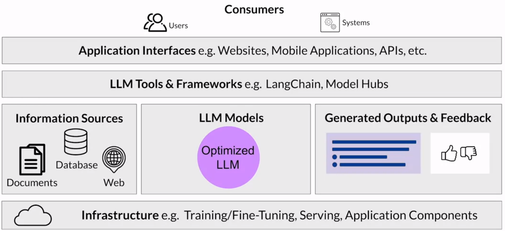

## Model Optimization by Reducing Model Size for Deployment

### Introduction

LLMs present inference challenges in terms of computing and storage requirements, as well as in ensuring low latency for consuming applications. These challenges are present irrespective of whether we are deploying on premises or to the cloud, and are even more prevalent when deploying to edge devices.

Reducing the size of the LLM is one of the primary ways to improve application performance. Reducing the size allows for quicker loading of the model, which reduces inference latency.

However, the challenge is to reduce the size of the LLM while still maintaining model performance.

### Techniques

The techniques available have a trade-off between accuracy and performance.

> [!NOTE]
> Not all techniques available for reducing model size in general work well with generative models.

#### Distillation

Distillation is a technique that involves using a larger LLM called the _teacher model_ to train a smaller LLM called the _student model_.

The student model learns to statistically mimic the behavior of the teacher model, either just in the final prediction layer or in the model's hidden layers as well.

When training a student model to mimic the behavior of the teacher model just in the final prediction, we have the following steps:

- Start with our fine-tuned LLM as the teacher model and create a smaller LLM for the student model. The weights of the teacher model are frozen.
- Use the teacher model to generate completions for the training data. At the same time, generate completions for the training data using the student model
- "Distill" the knowledge from the teacher model to the student model by minimizing a loss function which is a combination of a loss called the _student loss_ and a loss called the _distillation loss_, given by:

  $$\mathcal{L}(x;W) = \alpha * \mathcal{H}(y, \sigma(z_s;T=1)) + \beta * \mathcal{H}(\sigma(z_t;T=\tau), \sigma(z_s, T=\tau))$$

Here, $\mathcal{H}(y, \sigma(z_s;T=1))$ is the student loss and $\mathcal{H}(\sigma(z_t;T=\tau), \sigma(z_s, T=\tau))$ is the distillation loss.

In the above equation:

- $x$ is the input prompt.
- $W$ are the weights of the student model.
- $y$ is the ground-truth completion corresponding to $x$.
- $\mathcal{H}$ is the cross-entropy loss function.
- $z_t$ and $z_t$ are the logits from the teacher and student models respectively.
- $\sigma$ is the softmax function parameterized by the temperature $T$, calculated as:

  $$\sigma(z_i;T) = \frac{\exp(\frac{z_i}{T})}{\sum_j \exp(\frac{z_j}{T})}$$

  > [!NOTE]
  > Here, $z_i$ refers to a particular index in the logit vector $z$.

- $\tau$ is the temperature value we are using for training the student model and is a hyperparameter.
- $\alpha$ and $\beta$ are also hyperparameters.

This loss function is minimized to update the weights of the student model via backpropagation.

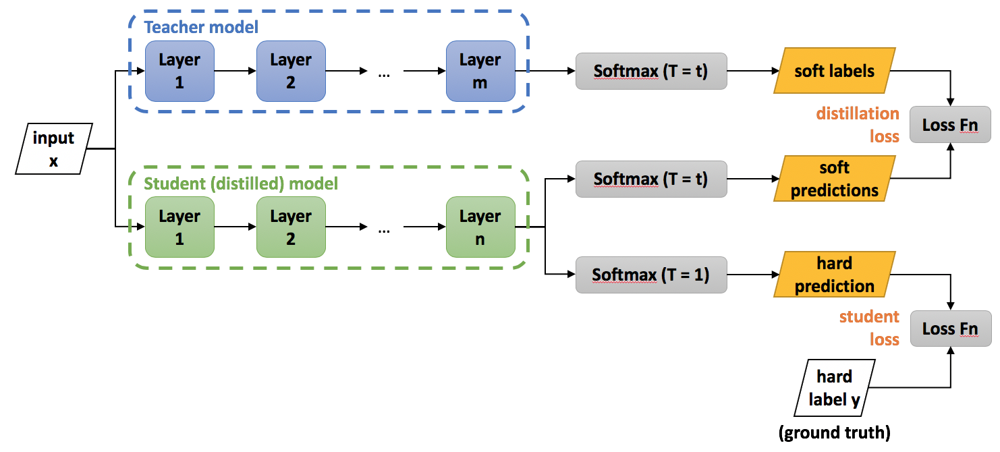

In essence, the distillation loss represents a classification task where the target is the probability distribution predicted by the teacher model. But, in many cases, this probability distribution has the correct class at a very high probability with all other other class probabilities very close to 0. Thus, it doesn't provide much information beyond the ground-truth labels already provided in the dataset.

Thus, we modify the softmax function by adding the temperature $T$ into it. As $T$ grows, the probability distribution generated by the softmax function become softer, providing more information as to which classes the teacher found more similar to the predicted class. In the literature, this is called the "dark knowledge" embedded in the teacher model and it is this dark knowledge that we are transferring to the student model.

In the context of LLMs, since the teacher model has already been fine-tuned on the training data, its probability distribution likely closely matches the ground-truth data and won't have much variation in tokens. By adding the temperature to the softmax, the student model receives more information in the form of a _set_ of tokens that are closer to the ground-truth data (since multiple tokens will have high probabilities).

The student loss just represents the standard loss (where $T = 1$) between the student's predicted class probabilities and the ground-truth labels.

In the literature:

- $\sigma(z_t;T=\tau)$ - that is, the softer distribution produced by the teacher model for the input prompt $x$ - is called **soft labels** (plural since it will have high probabilities in multiple places).
- $\sigma(z_s, T=\tau)$ - that is, the softer distribution produced by the student model for the input prompt $x$ - is called a **soft predictions** (plural due to the same reason).
- $\sigma(z_s;T=1)$ - that is, the actual prediction by the student model - is called a **hard prediction**.
- The ground-truth label $y$ is called a **hard label**.

In the end, we have a smaller model which can be used for faster inference in a production environment.

In practice, distillation is not very effective for decoder-only models such as GPT and is typically more effective for encoder-only models such as BERT.

#### Post-Training Quantization

This is different from quantization during training, which is also called quantization-aware training (QAT).

Once we have trained a model (with or without quantization), we can perform post-training quantization (PTQ) to reduce the size of our LLM and optimize it for deployment.

PTQ transforms a model's weight to a lower-precision representation such as 16-bit floating point (FP16 or BFLOAT16) or 8-bit integers (INT8). This reduces the model size and memory footprint, as well as the compute resources needed for model serving.

PTQ can be applied to the model weights or both to model weights and the activations. In general, quantization approaches that include the activations can have a higher impact on model performance (performance can go down).

It also requires an extra calibration step to statistically capture the dynamic range of the original parameter values.

PTQ has a trade-off as it has an impact on model performance by sometimes leading to a small percentage reduction in evaluation metrics, but the impact can often be worth the cost savings and performance gains.

#### Model Pruning

In model pruning, we reduce model size by eliminating model weights with values close or equal to zero since they are not contributing much to overall model performance.

Model pruning techniques broadly fall into three categories:

- Those that require full model retraining.
- Those that are under PEFT.
- Those that focus on post-training pruning.

In theory, this reduces model size and improves performance. In practice, a very small percentage of LLM weights are zero, which nullifies the performance gains.

## Inference Challenges in LLMs After Training

### Knowledge Cut-Off

The internal knowledge held by an LLM cut-offs at the moment of pre-training. In other words, the LLM becomes outdated due to the fact that the dataset is of finite quantity and has been collected up to a certain time period.

For example, if we trained a model in early 2022 and ask _Who is the British Prime Minister?_, it is likely to answer _Boris Johnson_. Johnson left office in late 2022 but the model has no knowledge of this since the event occurred after its training.

Below is an example from the current (September 25, 2023) version of ChatGPT (GPT 3.5). Notice the disclaimer added to the completion:


### Complex Math

LLMs also tend to perform poorly on complex math problems. If we ask the model to behave like a calculator, it may get the answer wrong depending on the difficulty of the problem.

For example, if we ask the model _What is 40366 / 439?_, it may generate an answer like _92.549_. This is close to the actual answer (91.949) but still incorrect.

This is because LLMs do not actually carry out mathematical operations and are still just trying to predict the next-best token based on their training. It's not necessary that the next-best token matches the correct answer.

Below is an example from the current (September 25, 2023) version of ChatGPT (GPT 3.5).


### Hallucination

LLMs have a tendency to generate text even when they don't know the answer to a problem, called hallucination.

For example, we can ask the LLM _What is a Martian Dunetree?_ and it might respond _A Martian Dunetree is a type of extraterrestrial plant found on Mars_. Despite there being no evidence of life on Mars, the model is happy to respond with confidence.

Below is an example from an old version of ChatGPT (GPT 3.5).

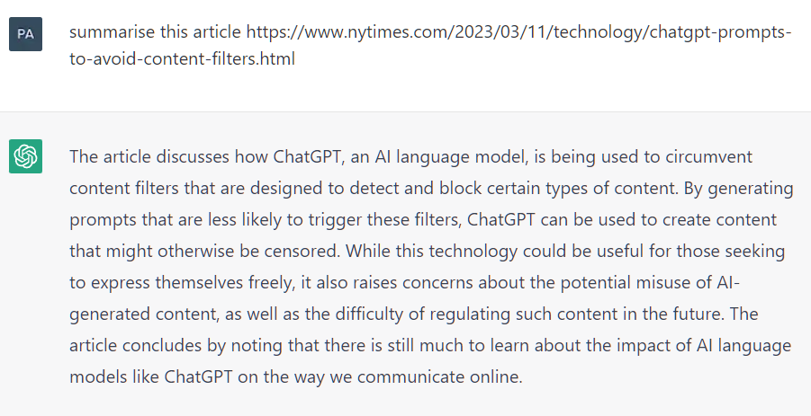

The article does not exist and in fact, even if it did GPT 3.5 has no way of accessing the link to know what the article says. Despite this, it happily generates a summary with confidence.

### Solving Inference Challenges

#### Introduction

To solve these issues, we need to connect the LLM to external data sources and applications.

We need to do a bit more work to connect an LLM to external components and fully integrate everything for deployment within our application. The application must manage the passing of user input to the LLM, as well as the return of completions from the LLM.

This is often done through some type of orchestration library.

> **Examples**: [LangChain](https://github.com/langchain-ai/langchain), [Haystack](https://github.com/deepset-ai/haystack), [LlamaIndex](https://github.com/run-llama/llama_index).

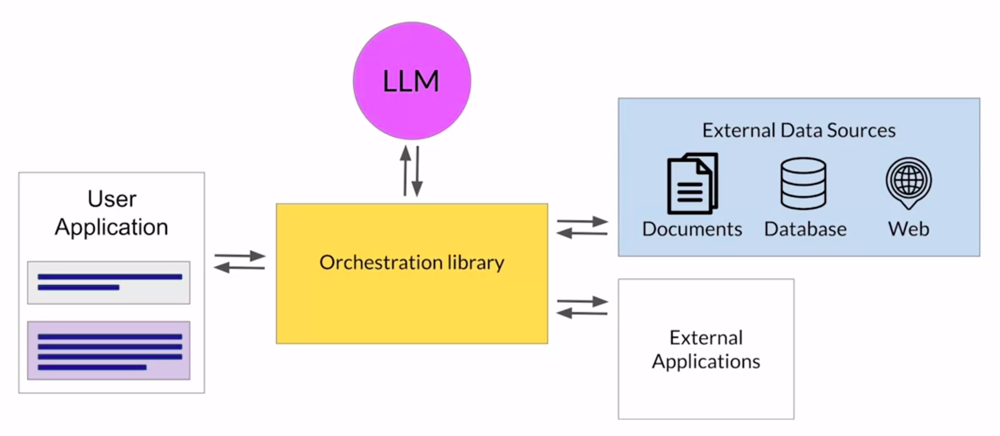

This layer can enable some powerful technologies that augment and enhance the performance of the LLM at runtime by providing access to external data sources or connecting to existing APIs of other applications.

#### Retrieval Augmented Generation (RAG)

##### Introduction

Retrieval Augmented Generation (RAG) is a framework for building LLM-powered systems that make use of external data sources and applications to overcome some of the limitations of these models.

For example, to overcome knowledge cutoff, we could retrain the model on new data, but this would quickly become very expensive and require repeated retraining to regularly update the model with new knowledge. A more flexible and less expensive way to overcome cutoffs is to give the model access to additional external data at inference time. We can achieve this using RAG.

Having access to external data can also avoid the problem of hallucination.

RAG is useful in any case where we want our LLM to have access to data it may not have seen during training such as new information, documents not included the training data or proprietary knowledge stored in our organization's private databases.

This can improve the relevance and accuracy of our model's completions.

##### Implementation

RAG is a framework and there are a number of different implementations available.

The implementation discussed here is based on _[Retrieval-Augmented Generation for Knowledge-Intensive NLP Tasks](https://research.facebook.com/file/4283170945104179/Retrieval-Augmented-Generation-for-Knowledge-Intensive-NLP-Tasks.pdf)_ (Facebook AI, 2020).

The **retriever** is what drives RAG.

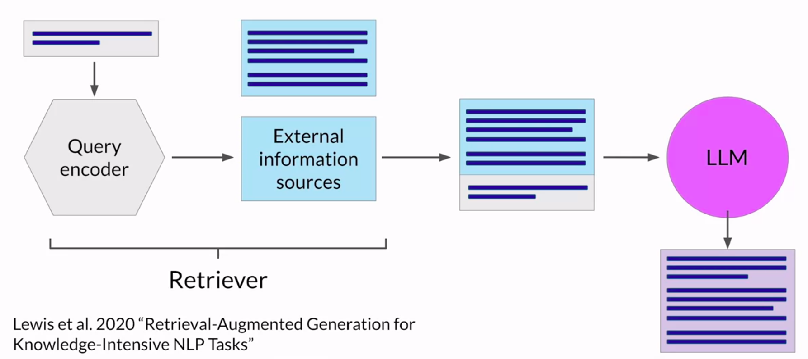

It consists of a _query encoder_ and an _external data source_. The query encoder takes the input prompt and encodes it in a form that can be used to query the external data source. In the paper, this data source is a vector store but it can be an SQL database, CSV files or other data storage formats.

These two components are trained together to find documents within the external data that are most relevant to the input query.

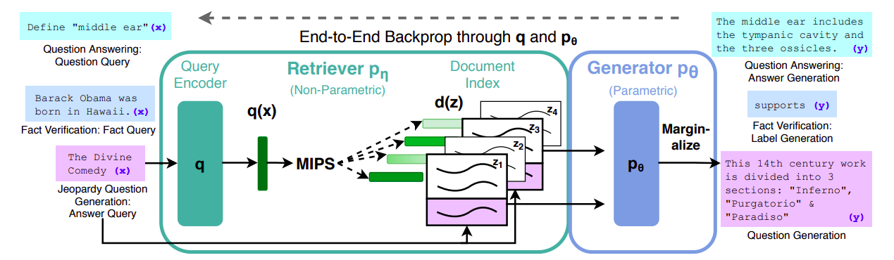

The retriever returns the best single or group of documents from the data source and combines the new information with the original input prompt. The new expanded prompt is then passed to the LLM, which generates a completion that makes use of the data.

##### Example - Searching Legal Documents

Consider a lawyer who is using an LLM to help them in the discovery phase of a case. RAG can help them ask questions related to a corpus of documents such as previous court filings.

Suppose they ask the model _Who is the plaintiff in case 22-48710BI-SME?_.

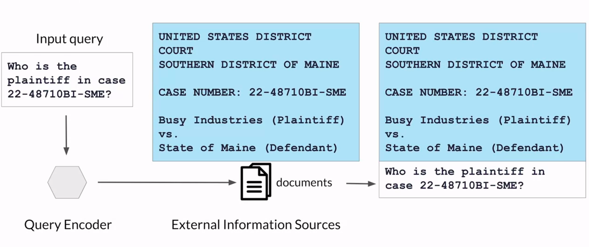

This is passed to the query encoder, which encodes the prompt in the same format as the external documents. It then searches for a relevant entry in the corpus of documents. Having found a piece of text that contains the requested information, the retriever then combines the piece of text with the original prompt:

> UNITED STATES DISTRICT COURT
>
> SOUTHERN DISTRICT OF MAINE
>
> CASE NUMBER: 22-48710BI-SME
>
> Busy Industries (Plaintiff) vs State of Maine (Defendant)
>
> Who is the plaintiff in case 22-48710BI-SME?

This expanded prompt is passed to the LLM. The model uses the information in the context of the prompt to generate a completion that contains the correct answer:

> Busy Industries

While the example is quite simple and only returns a single piece of information that could be found by other means, RAG can also be used to generate summaries of filings or identify specific people, places and organizations within the full corpus of legal documents.

##### Possible Integrations

RAG can be used to integrate multiple types of external information sources.

We can augment the LLM with access to:

- Local documents, including private wikis and expert systems.
- Internet to extract information posted on web pages such as Wikipedia.
- Databases by training the query encoder to encode prompts into SQL queries.
- Vector Stores, which contain vector representations of text. These enable a fast and efficient kind of relevance search based on similarity and are particularly useful for LLMs since internally LLMs work with vector representations of language to generate text.

##### Considerations in Implementation

Implementing RAG is a little more complicated than simply adding text into the LLM.

There are a couple of key considerations.

- **Context Window Size** - Most text sources are too long to fit in the limited context window of the model, which is still at most just a few thousand tokens. Instead, the external data sources are chopped up into many chunks, each of which will fit in the context window.
- **Data Format** - The external data should be available in a format that allows for easy retrieval of the most relevant text.

##### Vector Stores

We know that LLMs create vector representations of each token in an embedding space, which allow them to identify semantically related words through measures such as cosine similarity.

Thus, when using vector stores, we take each chunk of external data and process them through an LLM to create embedding vectors for each. These are then stored in the vector store, allowing for fast searching of datasets and efficient identification of semantically related text.

**Vector databases** are a particular implementation of a vector store where each vector is also identified by a key. This can allow, for instance, the text generated by RAG to also include a citation for the document from which it was received.

> **Examples**: [Chroma](https://github.com/chroma-core/chroma), [Pinecone](https://www.pinecone.io/), [Weaviate](https://github.com/weaviate/weaviate), [Faiss](https://github.com/facebookresearch/faiss), [QDrant](https://github.com/qdrant/qdrant).

## Interacting With External Applications

### Introduction

We know how to use RAG to allow an LLM to interact with external data sources. We can also augment the LLM by allowing it to interact with external applications.

### Motivating Example

Consider a shopping chatbot which should be able to process a return request from end to end.

The customer might ask something like _I need to return a pair of jeans that I purchased_. The bot could respond with _Can you tell me your order number?_ and the customer might provide the order number as _21104_.

The chatbot now needs to lookup the order number in the transaction database. One way of doing this is by using RAG, where the retriever encodes the user prompt as an SQL query and sends it to the transaction database. Once it gets a response from the database, it augments the original prompt with the details of the order.

After this, the bot needs to confirm the items that the user wants to return, replying _Okay, I've found your order. Do you want to return any other items from that order?_. The user might reply with _No, only the jeans_.

Now, the bot needs to fetch a return label from the company's shipping partner. For this, the bot uses the shipper's Python API to request the shipping label. The shipping label will be emailed to the user and so, the bot will also ask the user for their email. This information is included in the API call to the shipper.

Once the API request is completed, the bot lets the customer know that the shipping label has been sent to their email address, with some further instructions.

The example illustrates how LLMs can be used to trigger actions when given the ability to interact with APIs. They can also be connected to programming resources such as a Python interpreter that can enable models to incorporate accurate calculations into their outputs.

### Considerations for Prompts and Completions

Prompts and completions are at the very heart of these workflows since the actions that the app will take in response to user requests will be determined by the LLM, which serves as the application's reasoning engine.

In order to trigger actions, the completions generated by the LLM must contain certain important information:

- **Plan Actions** - The model needs to be able to generate a set of instructions so that the application knows what actions to take. These need to understandable and correspond to allowed actions. In the above example, the important steps were:
  - Checking order ID
  - Requesting return label from shipper
  - Verifying user email
  - Emailing user label
- **Format Outputs** - The completions need to be formatted in way that the broader application can understand. This could be as simple as a specific sentence structure or as complex as writing a script in Python or generating an SQL query. For example, an SQL query for the above example might be:

  ```sql
  SELECT COUNT(*)
  FROM orders
  WHERE order_id = 21104;
  ```

- **Validate Actions** - The model might need to collect information that allows it to validate an actions. In the above example, the bot needed to verify the email that the user provided. Any information that is required for validation needs to be obtained from the user and contained in the completions so it can be passed through to the application.

Structuring the prompt in the correct way is important for all of these considerations and can make a huge difference in the quality of a plan generated or the adherence to a desired output format specification.

### Challenges in Reasoning (Example With Math Problem)

Complex reasoning can be challenging for LLMs, especially for problems that involve multiple steps or mathematics. These problems exist even in LLMs that show good performance at many other tasks.

Consider the following prompt:

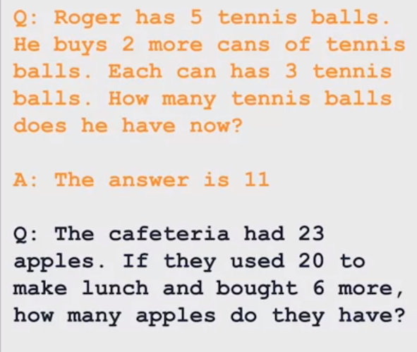

This is a simple multi-step math problem. The prompt includes a similar example problem with the answer to help the model understand the task through one-shot inference.

The model still gets it wrong, generating the answer 27 instead of 9 ($23 - 20 + 6 = 9$).

### Chain-of-Thought (CoT) Prompting

Researchers have been exploring ways to improve the performance of LLMs on reasoning tasks such as the one above.

One technique, called **Chain-of-Thought Prompting**, prompts the model to think more like a human by breaking the problem down into steps.

Humans take a step-by-step approach to solving complex problems. For the prompt above, a human might take the following steps:

- Determine the initial number of balls by considering that Roger started with 5 balls.
- Notice that 2 cans of 3 tennis balls each is 6 tennis balls.
- Add the 6 new balls to the initial number of balls to get $5 + 6 = 11$ as the answer.
- Report 11 as the answer.

The intermediate steps form the reasoning steps that a human might take and the full sequence of steps illustrates the "chain of thought" that went into solving the problem.

Asking the model to mimic this behavior is called chain-of-thought prompting. It works by including a series of intermediate reasoning steps to any example we use for one-shot or few-shot inference. By structuring the examples in this way, we are teaching the model to reason through a task to reach a solution.

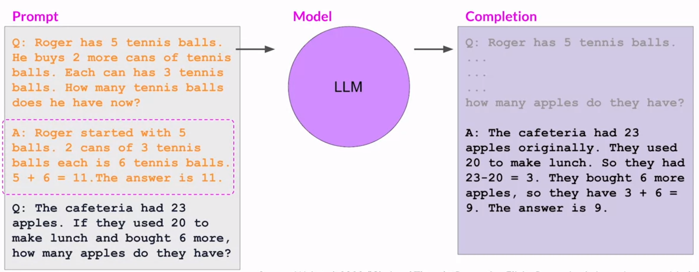

In the example above, we include the reasoning steps to calculate the correct answer for the example and the model then uses that same framework of reasoning to generate the correct response for the problem.

The chain-of-thought framework can be used to help LLMs solve other problems as well. An example is shown below.

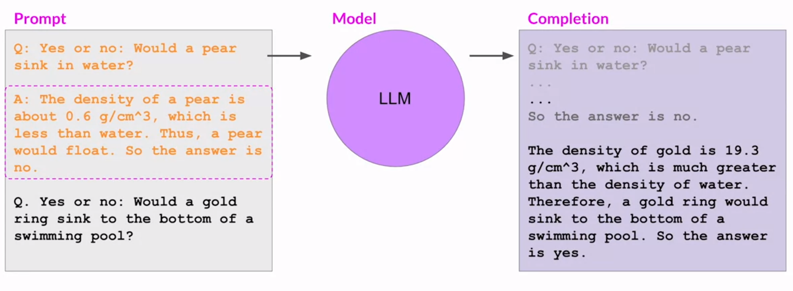

### Program-Aided Language (PAL) Models

> [!NOTE]
> This is _not_ related to the PALM class of models.

#### Introduction

The limited math skills of LLMs can still cause problems if the task requires accurate calculations such as totaling sales on an e-commerce site, calculating tax or applying a discount.

With chain-of-thought prompting, even though a model might reason through the problem correctly, it can make mistakes in the individual calculations, especially with larger numbers or complex operations. This is because there is no real math involved when the model is answering the question and it is still functioning as a text generator. The issue can be fixed by allowing the model to interact with external applications that are good at math, such as a Python interpreter.

One technique to achieve this is the **Program-Aided Language Models framework**. In PAL, the LLM is paired with an external code interpreter that can carry out calculations. It uses chain-of-thought prompting to generate executable Python (or some other language) scripts, which are then passed to the interpreter to execute.

The strategy behind PAL is to have the LLM generate completions where reasoning steps are accompanied by computer code, which are passed to the interpreter to execute. The output format for the model is specified by including examples for one-shot or few-shot inference in the prompt.

#### Prompt Structure

Below is an example of a typical prompt in the PAL framework.

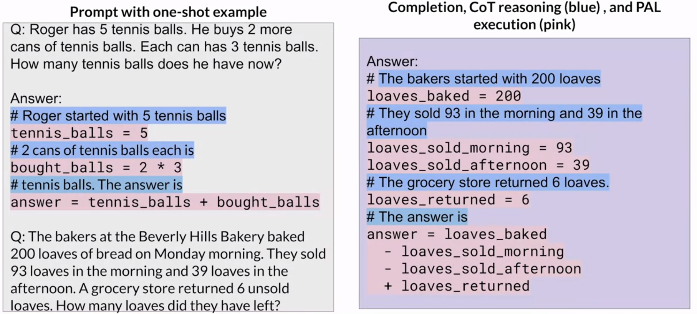

The one-shot example consists of a Python script, where the reasoning steps are mentioned as Python comments and are accompanied by the equivalent Python code. Together, the example forms a Python script. The one-shot example is followed by the problem we want the LLM to solve.

The completion is formatted similarly so that it is a valid Python script and can be passed to the Python interpreter for execution.

#### Overall Framework

To use PAL during inference, the steps are as follows:

- The prompt is formatted with one or more examples. Each example contains a question, followed by reasoning steps in lines of Python code that solve the problem.
- The new question that we want the LLM to solve is appended to the prompt template. The prompt now contains both the example(s) and the problem to solve.
- The combined prompt is passed to the LLM, which generates a completion that is in the form of a Python script. The LLM has learnt how to format the output as a Python script based on the example(s) in the prompt.
- The script passed to a Python interpreter, which will run the code and generate an answer.
- The text containing the answer is appended to the original prompt and passed to the LLM again.
- This time, the LLM generates the correct answer (not in the form of a Python script) since the answer is already in the context of the model.

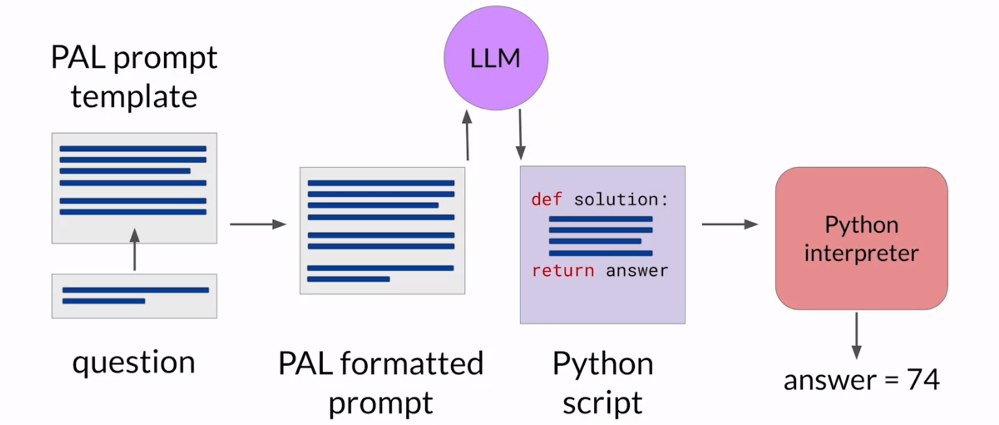

#### Automation

To avoid passing information back-and-forth between the LLM and the code interpreter manually, we use an orchestration library as discussed above.

The orchestration library manages the flow of information and the initiation of calls to external data sources or applications. It can also decide what actions to take based on the information contained in the output of the LLM.

The LLM is the application's reasoning engine and it creates the plan that the orchestration library will interpret and execute. In the case of PAL, there's only one action to be carried out - that is, the execution of Python code. The LLM doesn't have to _decide_ to run the code. It only has to write the script which the orchestration library will pass to the external interpreter to run.

### ReAct - Combining Reasoning and Action

Most real-world examples are likely to be more complicated than what the simple PAL framework can handle. Certain use cases may require interactions with several external data sources. In the chatbot example above, we saw that we may need to manage multiple decision points, validation actions and calls to external applications.

ReAct combines chain-of-thought prompting with action planning. It uses structured examples to show an LLM how to reason through a problem and decide on actions to take that move it closer to a solution.

#### Prompt Structure

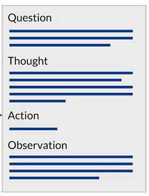

##### Question

The prompt starts with a question that will require multiple steps to answer.

For example, we can ask the question:

> Which magazine was started first, Arthur's Magazine or First for Women?

The question is followed by a (**thought**, **action**, **observation**) trio of strings.

##### Thought

The thought is a reasoning step that demonstrates to the model how to tackle the problem and identify an action to take.

For example, for the above question, it can be:

> I need to search Arthur's Magazine and First for Women, and find which one was started first.

##### Action

The action is an external task that the model can carry out from an allowed set of actions.

In case of ReAct, the paper involves a small Python API to interact with Wikipedia. There are three allowed actions:

- `search[entity]` - Look for a Wikipedia entry about a particular topic.
- `lookup[string]` - Search for a string on a Wikipedia page.
- `finish[answer]` - An action which the model carries out when it decides it has determined the answer.

The action to be taken is determined by the information in the preceding thought section of the prompt.

Continuing with the example, initially there would be one action:

> `search[Arthur's Magazine]`

##### Observation

The observation section contains the new information provided by the external actions so that it is in the context of the prompt.

For example, the observation after carrying out the action above could be something like:

> Arthur's Magazine (1844-1846) was an American literary periodical published in Philadelphia in the 19th century.

#### Obtaining the Final Answer

This cycle of (**thought**, **action**, **observation**) is repeated as many times as required to obtain the final answer.

For example:

- The second thought could be:

  > Arthur's Magazine was started in 1844. I need to search First for Women next.

- The next action would be:

  > `search[First for Women]`

- The observation could be:

  > First for Women is a woman's magazine published by Bauer Media Group in the USA. The magazine was started in 1989.

- The third thought could be:

  > First for Women was started in 1989. 1844 (Arthur's Magazine) < 1989 (First for Women). So, Arthur's Magazine was started first.

  Note that the thought also contains the explicit logic used to determine which magazine was published first.

- The final action is:

  > `finish[Arthur's Magazine]`

This will give the final answer.

#### Initial Instructions

In ReAct, the LLM can only choose from a limited number of actions that are defined by a set of instructions that is pre-pended to the example prompt text. For example:


This is followed by a set of examples, where each example can contain multiple (**thought**, **action**, **observation**) trios.

#### Putting It All Together

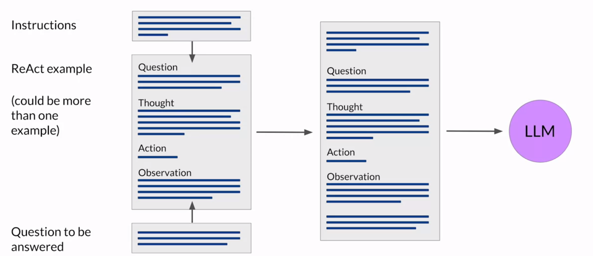

For inference:

- We start with the ReAct example prompt. Depending on the LLM we are working with, we may need to include more than one example and carry out few-shot inference.
- We then pre-pend the instructions at the beginning of the examples.
- We then insert the question we want the LLM to answer.

The full prompt thus includes all of these individual pieces and it can be passed to the LLM for inference.

### Model Size and Reasoning Ability

The ability of a model to reason well and plan actions depends on its scale. Generally speaking, larger models are better for techniques that use advanced prompting like PAL or ReAct. Smaller models may struggle to understand the tasks in highly structured prompts and may require additional fine-tuning to improve their ability to reason and plan.

This would increase the development time. Thus, it is better to start with a larger, more capable model and collect lots of user data in deployment. We can later use this data to train and fine-tune a smaller model that we can switch to at a later time.

## Useful Resources

### Reducing Model Size

- [Distillation paper - Distilling the Knowledge in a Neural Network](https://arxiv.org/pdf/1503.02531.pdf).
- [PyTorch Tutorial on Distillation](https://pytorch.org/tutorials/beginner/knowledge_distillation_tutorial.html*).
- [PyTorch Tutorial on Quantization, including PTQ](https://pytorch.org/docs/stable/quantization.html).
- [TensorFlow Tutorial on PTQ](https://www.tensorflow.org/model_optimization/guide/quantization/post_training).
- [PyTorch tutorial on Model Pruning](https://pytorch.org/tutorials/intermediate/pruning_tutorial.html).
- [Weights and Biases Tutorial on Model Pruning](https://wandb.ai/authors/pruning/reports/Diving-Into-Model-Pruning-in-Deep-Learning--VmlldzoxMzcyMDg).

### Inference Challenges

- [Criticism of LangChain on HackerNews](https://news.ycombinator.com/item?id=36725982).
- [RAG paper - Retrieval-Augmented Generation for Knowledge-Intensive NLP Tasks](https://research.facebook.com/file/4283170945104179/Retrieval-Augmented-Generation-for-Knowledge-Intensive-NLP-Tasks.pdf).
- [Blog post by Facebook on RAG](https://ai.meta.com/blog/retrieval-augmented-generation-streamlining-the-creation-of-intelligent-natural-language-processing-models/).

### Interacting With External Applications

- [Chain-of-Thought Prompting paper - Chain-of-Thought Prompting Elicits Reasoning in Large Language Models](https://arxiv.org/pdf/2201.11903.pdf).
- [Program-Aided Language (PAL) Models paper - PAL: Program-aided Language Models](https://arxiv.org/pdf/2211.10435.pdf).
- [LangChain documentation](https://python.langchain.com/docs/get_started/introduction).
- [PAL example using LangChain](https://www.promptingguide.ai/applications/pal).
- [ReAct paper - ReAct: Synergizing Reasoning and Acting in Language Models](https://arxiv.org/pdf/2210.03629.pdf).
- [ReAct example using LangChain](https://www.promptingguide.ai/techniques/react).
