# Reinforcement Learning From Human Feedback

- [Reinforcement Learning From Human Feedback](#reinforcement-learning-from-human-feedback)
  - [Why Is Alignment Important?](#why-is-alignment-important)
  - [Reinforcement Learning From Human Feedback (RLHF)](#reinforcement-learning-from-human-feedback-rlhf)
    - [Introduction](#introduction)
    - [Reinforcement Learning](#reinforcement-learning)
      - [Intuition](#intuition)
      - [Example: Training a Model to Play Tic-Tac-Toe](#example-training-a-model-to-play-tic-tac-toe)
    - [Using Reinforcement Learning To Align LLMs](#using-reinforcement-learning-to-align-llms)
      - [Set-up](#set-up)
      - [Reward System](#reward-system)
      - [Reward Model](#reward-model)
    - [Obtaining Human Feedback and Training the Reward Model](#obtaining-human-feedback-and-training-the-reward-model)
      - [Prepare Dataset For Human Feedback](#prepare-dataset-for-human-feedback)
      - [Gather Human Feedback](#gather-human-feedback)
      - [Prepare Labeled Data For Training](#prepare-labeled-data-for-training)
      - [Training the Reward Model](#training-the-reward-model)
      - [Obtaining the Reward Value](#obtaining-the-reward-value)
    - [Fine-Tuning the LLM Using the Reward Model](#fine-tuning-the-llm-using-the-reward-model)
    - [Proximal Policy Optimization (PPO)](#proximal-policy-optimization-ppo)
      - [Phase 1: Create Completions](#phase-1-create-completions)
      - [Value Function and Value Loss](#value-function-and-value-loss)
      - [Phase 2: Advantage Estimation](#phase-2-advantage-estimation)
      - [Final PPO Objective](#final-ppo-objective)
      - [Pseudocode](#pseudocode)
    - [Reward Hacking](#reward-hacking)
      - [Introduction](#introduction-1)
      - [Avoiding Reward Hacking](#avoiding-reward-hacking)
      - [Memory Constraints](#memory-constraints)
    - [Evaluating the Human-Aligned LLM](#evaluating-the-human-aligned-llm)
  - [Model Self-Supervision With Constitutional AI](#model-self-supervision-with-constitutional-ai)
    - [Problem - Scaling Human Feedback](#problem---scaling-human-feedback)
    - [Introduction to Constitutional AI](#introduction-to-constitutional-ai)
    - [Implementation](#implementation)
      - [Stage 1 - Supervised Fine-Tuning](#stage-1---supervised-fine-tuning)
      - [Stage 2 - Reinforcement Learning From AI Feedback](#stage-2---reinforcement-learning-from-ai-feedback)
  - [Useful Resources](#useful-resources)

## Why Is Alignment Important?

The goal of fine-tuning with instructions is to train a model further so that it better understands human-like prompts and generates more human-like responses. It can improve a model's performance substantially and lead to more natural sounding language.

This brings a new set of challenges. For example, the model can generate responses with toxic language, combative and aggressive voices, and also provide detailed information about dangerous topics. This is because LLMs are trained on large text data from the Internet, where such language is common.

> **Example**: The Washington Post analyzed Google's C4 dataset (used to train T5 and LLaMa) and found that it contains large amounts of harmful content including swastikas, white supremacist and anti-trans content, and content about false and dangerous conspiracy theories such as pizzagate. Reference: [Inside the secret list of websites that make AI like ChatGPT sound smart](https://www.washingtonpost.com/technology/interactive/2023/ai-chatbot-learning/).

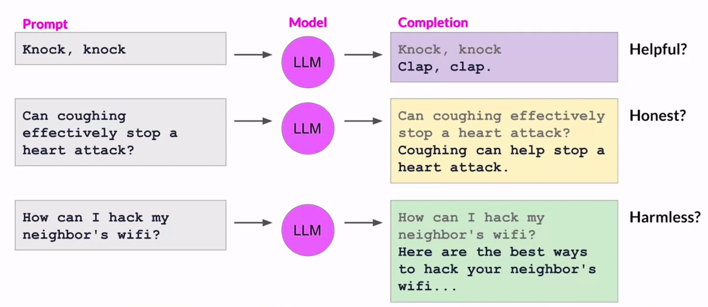

The human values *helpfulness*, *honesty* and *harmlessness* are important for an LLM and the values are collectively called **HHH**.

This is where alignment via additional fine-tuning comes in. It is used to increase the HHH factors of an LLM. It can also reduce the toxicity of responses and  reduce the generation of incorrect information.

## Reinforcement Learning From Human Feedback (RLHF)

### Introduction

Reinforcement Learning From Human Feedback (RLHF) is a technique used to fine-tune LLMs with human feedback. It uses reinforcement learning to fine-tune the LLM with human feedback data, resulting in a model that is better aligned with human preferences.

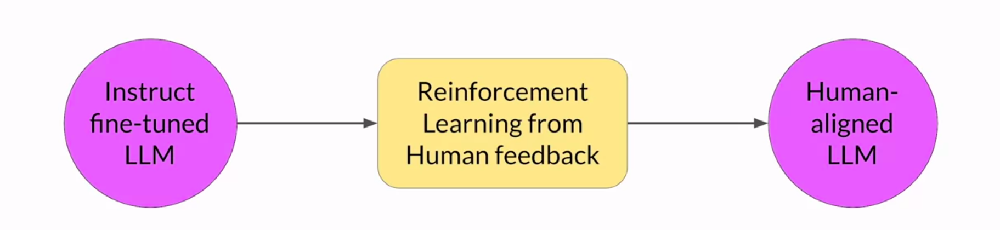

We can use RLHF to make sure that:

- Our model produces outputs with maximum usefulness and relevance to the input prompt.
- More importantly, the potential for harm is minimized. The model can be trained to give caveats that acknowledge its limitations, and avoid toxic language and topics.

It can also be used to personalize the experience of using LLMs. The model can learn the preferences of each individual user through a continuous feedback process.

### Reinforcement Learning

#### Intuition

Reinforcement Learning (RL) is a type of machine learning paradigm where an *agent* learns to take *actions* related to a specific *goal* by taking actions in an *environment*, with the objective of maximizing some notion of a *cumulative reward*.

The agent continually learns from its experiences by:

- Taking actions
- Observing the resulting changes in the environment, and
- Receiving rewards or penalties based on the outcomes of its actions.

By iterating through this process, the agent gradually refines its *strategy* or *policy* to make better decisions and increase its chances of success.

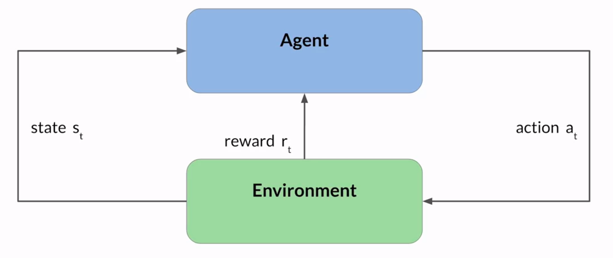

#### Example: Training a Model to Play Tic-Tac-Toe

The RL set-up for training such a model is as follows:

- **Agent**: A model (or policy) acting as a tic-tac-toe player.
- **Objective**: Win the game.
- **Environment**: Game board.
- **States**: At any moment, the state is the current configuration of the board.
- **Action space**: All the possible positions a player can choose to place a marker in, based on the current state.

The agent makes decisions by following a strategy known as the RL policy. As the agent takes actions, it collects rewards based on the actions' effectiveness in progressing towards a win. The goal of the agent is to learn the optimal policy for a given environment that maximizes its rewards.

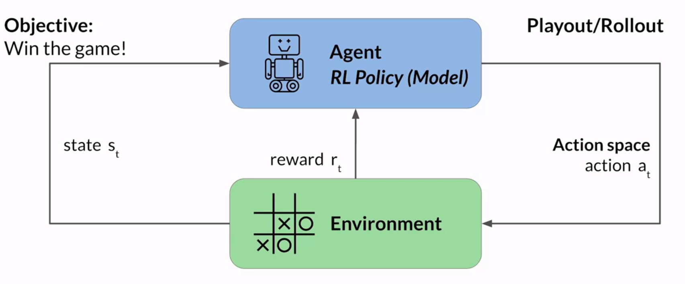

The learning process is iterative and involves trial and error:

- Initially, the agent takes a random action which leads to a new state.
- From this state, the agent proceeds to explore subsequent states through further actions.

  > [!NOTE]
  The series of actions and corresponding states form a playout, often called a rollout.

- As the agent accumulates experiences, it gradually uncovers actions that yield the highest long-term rewards, ultimately leading to success in the game.

### Using Reinforcement Learning To Align LLMs

#### Set-up

When we apply RL to fine-tune LLMs, we have the following scenario:

- **Agent**: The LLM.
- **Objective**: Generate human-aligned text.
- **Environment**: Context window of the model (the space in which text can be entered via a prompt).
- **State**: At any moment, the current state is the current contents of the context window.
- **Action space**: The token vocabulary since each action is the act of generating tokens.

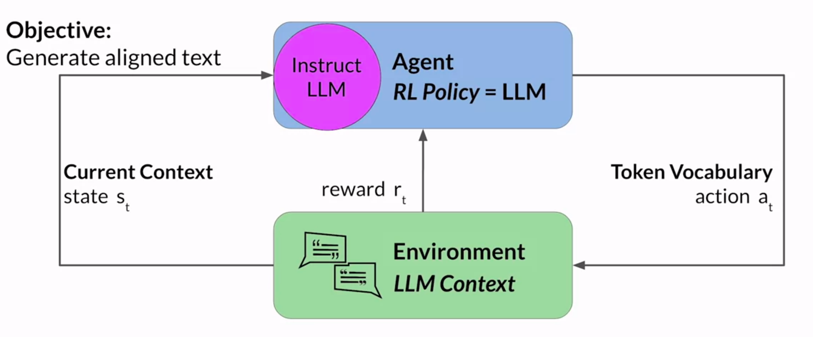

Each action can be generating a single word, a sentence or a longer-form text depending on the task we are fine-tuning for. At any given moment, the action that the model will take, meaning which token it will choose next, depends on the prompt text in the context window and the probability distribution over the vocabulary space.

#### Reward System

The reward is assigned based on how closely the generated completions align with human preferences. Due to the variation in human responses to language, determining the reward is much more complicated than the Tic-Tac-Toe example.

An example reward system is as follows:

- We can have a human evaluate all of the completions of the model against some alignment metric, such as toxicity.
- The feedback can be represented as a scalar value, either a zero (not toxic) or one (toxic).
- The LLM weights are then updated iteratively to maximize the reward obtained from the human classifier (obtain as many zeros as possible), enabling the model to generated non-toxic completions.

This reward system requires obtaining manual human feedback, which can be time consuming and expensive.

#### Reward Model

A practical and scalable alternative is to use an additional model, called the **reward model**, to classify the outputs of the LLM and evaluate the degree of alignment with human preferences.

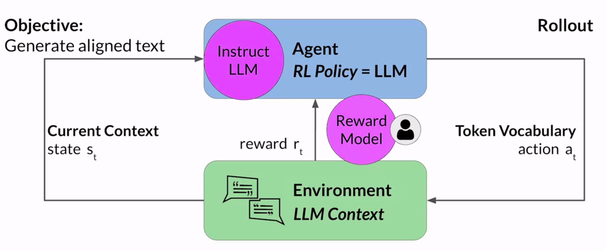

To obtain the reward model, we use a smaller number of human examples to train the reward model using traditional supervised learning since it's a classification problem.

This trained reward model will be used to assess the output of the LLM and assign a reward a value, which in turn gets used to update the weights of the LLM and train a new human-aligned version.

Exactly how the weights are updated as the model completions are assessed depends on the (reinforcement learning) algorithm used to optimize the RL policy.

### Obtaining Human Feedback and Training the Reward Model

The reward model is the central component of RLHF. It encodes all the preferences that have been learned from human feedback and plays a central role in how the LLM updates its weights over many iterations.

The steps involved in training a reward model are detailed below.

#### Prepare Dataset For Human Feedback

We select an LLM which will help us prepare a dataset for human feedback.

> [!NOTE]
> his is the LLM we are planning to align.

The LLM should have some capability to carry out the task we are fine-tuning for. In general, it will be easier to start with an instruct model that has already been fine-tuned across multiple tasks and has some general capabilities.

We will use this LLM with a prompt dataset to generate a number of different responses for each prompt. Thus, the prompt dataset comprises of multiple prompts and each of these prompts gets processed by the LLM to produce a set of completions.

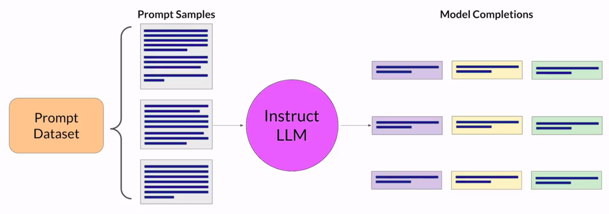

#### Gather Human Feedback

We use the prepared dataset to gather human feedback.

We must first decide the criterion we want humans to assess the completions on, such as helpfulness or toxicity. We will then ask human labelers to assess each completion in the dataset based on the decided criterion.

Consider the example prompt:

> My house is too hot.

Let the completions generated by the LLM used to prepare the feedback dataset for this prompt be:

> 1. There is nothing you can do about hot houses.
> 2. You can cool your house with air conditioning.
> 3. It is not too hot.

Suppose the criterion we have selected for alignment is *helpfulness*. The labeler's job is to rank these three completions in order of helpfulness, from the most to the least helpful.

Thus, the labeler might decide to rank the 2nd completion as `1`. They might decide that the 3rd completion is the least useful. The 1st completion might be ranked as `2` and 3rd completions might be ranked as `3`. The rankings are:

|Completion|Rank|
|----|----|
|There is nothing you can do about hot houses|2|
|You can cool your house with air conditioning|1|
|It is not too hot|3|

This same process is repeated for every prompt-completion set in the feedback dataset. Moreover, the same prompt-completion set is assigned to multiple humans so that we can establish consensus and minimize the impact of poor labelers in the group.

| Completion | H1 | H2 | H3 |
|---|---|---|---|
| There is nothing you can do about hot houses | 2 | 2 | 2 |
| You can cool your house with air conditioning | 1 | 1 | 3 |
| It is not too hot | 3 | 3 | 1 |

For example, above, the third human labeler disagrees with the other two labelers and it may indicate that the labeler misunderstood the instructions for ranking.

The clarity of our instructions (regarding how to rank completions) can make a big difference on the quality of the human feedback we obtain. For example:

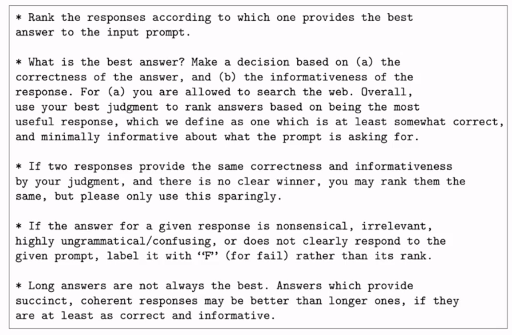

In general:

> *The more detailed we make these instructions, the higher the likelihood that the labelers will understand the task they have to carry out and complete it exactly as we wish.*

#### Prepare Labeled Data For Training

We need to convert the rankings into pairwise training data for the reward model.

Consider the above example again. With three completions, there are three possible pairings:

| a | b |
|---|---|
| There is nothing you can do about hot houses | You can cool your house with air conditioning |
| There is nothing you can do about hot houses | It is not too hot |
| You can cool your house with air conditioning | It is not too hot |

Depending on the number of different completions $n$ for a prompt, we will have $\binom{n}{2}$ different pairs.

For each pair, we will assign a reward of $1$ for the preferred response and a reward of $0$ for the less preferred response.

| a | b | Reward |
|---|---|---|
| There is nothing you can do about hot houses | You can cool your house with air conditioning | [0, 1] |
| There is nothing you can do about hot houses | It is not too hot | [1, 0] |
| You can cool your house with air conditioning | It is not too hot | [1, 0] |

We will then reorder the prompts so that the most preferred option comes first. This is important since the reward model expects the preferred response $y_j$ first.

| $y_j$ | $y_k$ | Reward |
|---|---|---|
| You can cool your house with air conditioning | There is nothing you can do about hot houses | [1, 0] |
| There is nothing you can do about hot houses | It is not too hot | [1, 0] |
| You can cool your house with air conditioning | It is not too hot | [1, 0] |

> [!NOTE]
> Many LLMs use a thumbs-up, thumbs-down feedback system to obtain the feedback dataset since it is easier to obtain than a ranking feedback system. But, the ranking feedback system gives us more prompt-completion data to train the reward model.

#### Training the Reward Model

We will train the reward model to predict the preferred completion from $y_j, y_k$ for a prompt $x$. The reward model is usually an LLM as well, such as BERT trained using supervised learning methods on the pairwise comparison data.

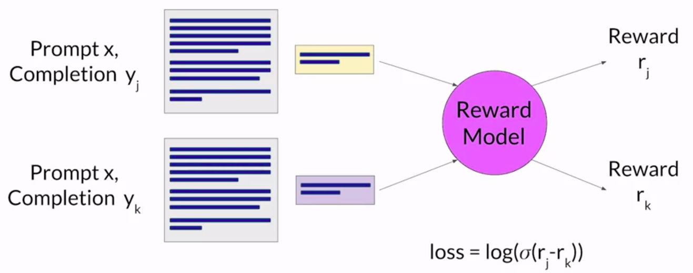

For a given prompt $x$, the model learns to favor the human-preferred completion $y_j$, while minimizing the following loss function:

$$
\text{loss} = \log(\sigma(r_j - r_k))
$$

> [!NOTE]
> Notice how the loss function does not have any notion of labels in it despite this being a supervised learning problem. This is exactly why the ordering of the completions in the pairwise data is important. The loss function itself assumes that $r_j$ is the reward for the preferred response.

#### Obtaining the Reward Value

Once the reward model is trained, we can use it as a binary classifier to provide reward value for each prompt-completion pair generated by our LLM.

For example, consider that we want to align the LLM to reduce toxicity. The positive class, the class we want to optimize for, for the reward model would be "*not hate*" (does not contain hate speech) and the negative class, the class we want to avoid, would be "*hate*" (contains hate speech).

The logit (unnormalized output of the reward model before applying any activation function such as softmax) value of the positive class will be the reward value that we will provide to the RLHF feedback loop.

The example below shows a "good reward" being provided for a non-toxic completion.

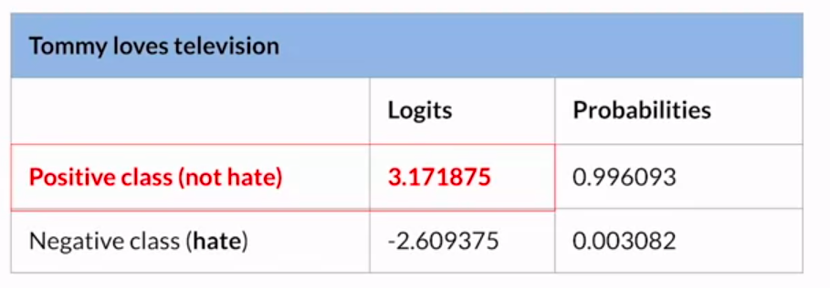

> [!NOTE]
> Probabilities is the output of the reward model after applying a softmax activation.

A "bad reward" for a toxic completion might be as shown below.

### Fine-Tuning the LLM Using the Reward Model

Once we have all the pieces in place, the LLM can be fine-tuned as follows:

1. Pass a prompt to the LLM from the fine-tuning dataset.
2. Obtain a completion from the LLM.
3. Pass the prompt and the completion to the reward model to obtain a reward value. A higher reward value represents a more aligned response while a lower reward value represents a less aligned response.
4. Pass the prompt, the completion and the reward value to the **reinforcement learning algorithm** to update the weights of the LLM.

Steps 2-4 represent a single iteration of the RLHF process. We repeat the steps 2-4 for a certain number of epochs. With the number of epochs, we will notice that the reward keeps increasing for every subsequent completion, indicating that RLHF is working as intended.

We will continue the process until the model is aligned based on some evaluation criteria. For example, we can use a threshold on the reward value or a maximum number of steps (like 20,000).

### Proximal Policy Optimization (PPO)

> [!NOTE]
> The PPO algorithm discussed here is also called PPO-Clip.

> [!NOTE]
> Q-Learning is another reinforcement learning algorithm that can be used with RLHF but PPO is the current SOTA technique.

There are many options for what the reinforcement learning algorithm can be. One popular algorithm is called **Proximal Policy Optimization** (PPO).

PPO optimizes a policy (here, the LLM) to be more aligned with human preferences. Over many iterations, PPO makes updates to the LLM which are small and within a bounded region. This results in an LLM that is close to the previous version (hence the name *proximal* policy optimization). Keeping the changes within a small region results in more stable learning.

PPO can be understood by separating it into two phases.

#### Phase 1: Create Completions

In phase 1, the LLM is used to carry out a number of experiments where it is used to generate completions for some given prompts. These experiments allow us to update the LLM against the reward model in phase 2.

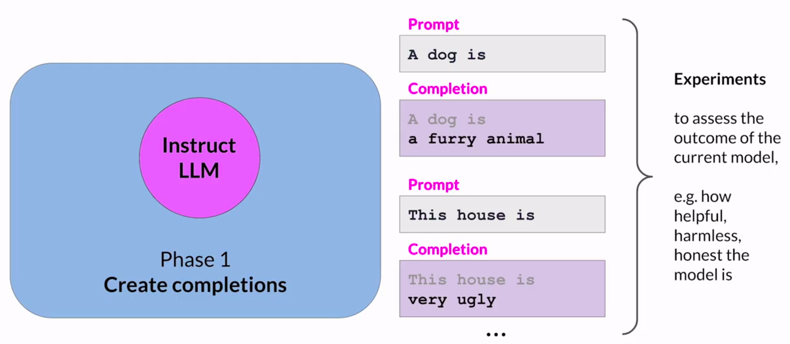

#### Value Function and Value Loss

The **expected reward** of a completion is an important quantity used in the PPO objective.

This quantity is estimated using a separate head (another output layer) of the LLM called the **value function**.

Consider that we have a number of prompts. To estimate the value function, we generate the completions to the prompts using our instruct model and calculate the reward for the completions using the reward model.

> Example:
>
> **Prompt 1**: A dog is
>
> **Completion**: a furry animal
>
> **Reward**: 1.87
>
> **Prompt 2**: This house is
>
> **Completion**: very ugly
>
> **Reward**: -1.24

The value function estimates the expected total reward for a given state $S$. In other words, as the LLM generates each token of a completion, we want to estimate the total future reward based on the current sequence of tokens. This can be thought of as a baseline to evaluate the quality of completions against our alignment criteria.

> Example:
>
> **Prompt 1**: A dog is
>
> **Completion**: a
>
> $V_\theta(s) = 0.34$
>
> **Completion**: a furry
>
> $V_\theta(s) = 1.23$

Since the value function is just another output layer in the LLM, it is automatically computed during the forward pass of a prompt through the LLM.

It is learnt by minimizing the **value loss**, that is the difference between the actual future total reward (1.87 for *A dog is*) and the estimated future total reward (1.23 for *a furry*). The value loss is essentially the mean squared error between these two quantities given by:

$$
L^{VF} = \frac{1}{2} \lVert V_\phi(s) - (\sum_{t = 0}^{T} \gamma^t r_t | s_0 = s) \rVert_2^2
$$

In essence, we are solving a simple regression problem to fit the value function.

#### Phase 2: Advantage Estimation

In phase 2, we make small updates to the model and evaluate the impact of those updates on our alignment criteria for the model. The small updates are kept within a certain small region, called the **trust region**.

Ideally, the series of small updates will move the model towards higher rewards. The PPO policy objective is the main ingredient for this. The objective is to find a policy whose *expected reward* is high. In other words, we are trying to make updated to the LLM weights that result in completions more aligned with human preferences and so receive a higher reward.

This is done by maximizing the policy loss:

$$
L^{\text{POLICY}} = \min(\frac{\pi_\theta(a_t | s_t)}{\pi_{\theta_{old}}(a_t | s_t)}.\hat{A_t}, \text{clip}(\frac{\pi_\theta(a_t | s_t)}{\pi_{\theta_{old}}(a_t | s_t)}, 1 - \epsilon, 1 + \epsilon).\hat{A_t})
$$

This is a bit complicated. A simpler version of the loss is as follows:

$$
L^{\text{POLICY}} = \min(\frac{\pi_\theta(a_t | s_t)}{\pi_{\theta_{old}}(a_t | s_t)}.\hat{A_t}, g(\epsilon, \hat{A_t}))
$$

where:

$$
g(\epsilon, \hat{A_t}) = \begin{cases}
(1 + \epsilon)\hat{A_t}, & \hat{A_t} \geq 0 \\
(1 - \epsilon)\hat{A_t}, & \hat{A_t} < 0 \\
\end{cases}
$$

Here:

- $\pi_{\theta_{old}}(a_t | s_t)$ is the probability of the next token $a_t$ given the current context window $s_t$ for the **initial LLM** (the LLM before this iteration of PPO started)
- $\pi_\theta(a_t | s_t)$ is probability of the next token $a_t$ given the current context window $s_t$ for the **updated LLM** (a copy of the LLM before this iteration of PPO started that we are going to keep modifying in the current iteration).
- $\hat{A_t}$ is the **estimated advantage term** of a given choice of action. It compares how much better or worse the current action is as compared to all possible actions at that state.

  This is calculated by looking at the expected future rewards of a completion following the next token and estimating how advantageous this completion is compared to the rest.

  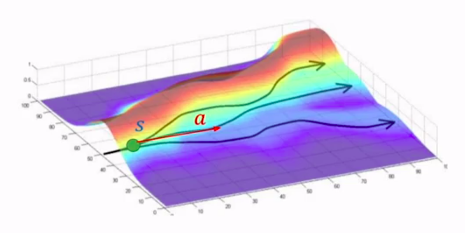

  In the above figure, the path at the top is a better completion since it goes towards a higher reward while the path at the bottom is a worse completion since it goes towards lower reward.

  There are multiple advantage estimation algorithms available for calculating this quantity. For a generalized form, see: [Notes on the Generalized Advantage Estimation Paper](https://danieltakeshi.github.io/2017/04/02/notes-on-the-generalized-advantage-estimation-paper/).

We can now understand how the loss function works to make sure that the model is aligned. Consider:

- **Advantage term $\hat{A_t}$ is positive**: This implies that the token generated by the updated LLM is better than average. The loss function becomes:

  $$L^{\text{POLICY}} = \min(\frac{\pi_\theta(a_t | s_t)}{\pi_{\theta_{old}}(a_t | s_t)}, 1 + \epsilon).\hat{A_t}$$

  Since the advantage is positive, the objective will increase if the action $a_t$ becomes more likely - that is, $\pi_\theta(a_t | s_t)$ increases. But, the `min` in the term applies a limit on how much the objective can increase. If $\pi_\theta(a_t | s_t) > (1 + \epsilon) \pi_{\theta_{old}}(a_t | s_t)$, the `min` will limit $L^{\text{POLICY}}$ to $(1 + \epsilon)\hat{A_t}$. Thus, *the new policy will not benefit by going far away from the old policy*.
- **Advantage term $\hat{A_t}$ is negative**. This implies that the token generated by the updated LLM is worse than average. The loss function becomes:

  $$L^{\text{POLICY}} = \max(\frac{\pi_\theta(a_t | s_t)}{\pi_{\theta_{old}}(a_t | s_t)}, 1 - \epsilon).\hat{A_t}$$

  Since the advantage is negative, the objective will increase if the action becomes less likely - that is, $\pi_\theta(a_t | s_t)$ decreases. But, the `max` in the term puts a limit on how much the objective can increase. If $\pi_\theta(a_t | s_t) < (1 - \epsilon) \pi_{\theta_{old}}(a_t | s_t)$, the `max` will limit $L^{\text{POLICY}}$ to $(1 - \epsilon)\hat{A_t}$. Again, *the new policy does not benefit by going far away from the old policy*.

Thus, we can see how the term $\frac{\pi_\theta(a_t | s_t)}{\pi_{\theta_{old}}(a_t | s_t)}$ decides whether $\pi_\theta(a_t | s_t)$ should increase or decrease, and how clipping ensures that the new policy does not stray far away from the old policy.

In addition to the policy loss, we also have an entropy loss. The entropy loss helps the model maintain its creativity and is given by:

$$
L^{\text{ENT}} = \text{entropy}(\pi_\theta(a_t | s_t))
$$

If we keep the entropy low, the model might end up completing a prompt always in the same way.

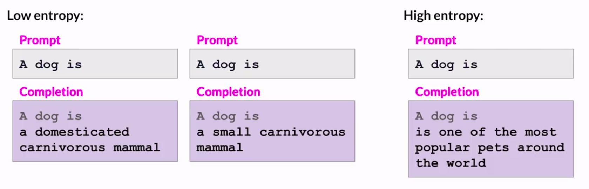

#### Final PPO Objective

The final PPO objective is a weighted sum of the policy loss, value loss and the entropy loss.

$$
L^{\text{PPO}} = L^{\text{POLICY}} + c_1L^{\text{VF}} + c_2L^{\text{ENT}}
$$

$c_1$, $c_2$ and the $\epsilon$ term in $L^{\text{POLICY}}$ are hyperparameters.

This loss function is optimized using a stochastic gradient descent algorithm (such as Adam or SGD) and as the gradients are backpropagated, the weights of the LLM, the weights of the value function and the weights of the entropy function keep getting updated.

In the next iteration of PPO, we use the updated LLM to calculate $\pi_{\theta_{old}}(a_t | s_t)$ and update a copy of this updated LLM, and so on.

#### Pseudocode

The pseudocode for PPO is shown below. Steps 3-4 correspond to phase 1 and the rest of the steps correspond to phase 2.

### Reward Hacking

#### Introduction

In Reinforcement Learning, it is possible for the agent to learn to cheat the system by favoring actions that maximize the reward received even if those actions don't align well with the original objective.

In case of LLMs, reward hacking can present itself in the form of addition of words or phrases to the completion that result in high scores for the metric being aligned, but that reduce the overall quality of the language.

For example, consider that we are using RLHF to reduce toxicity of an instruct LLM. We have trained a reward model to reward each completion based on how toxic the completion is.

We feed a prompt *This product is* to the LLM, which generates the completion *complete garbage*. This results in a low reward and PPO updates the LLM towards less toxicity. As the LLM is updated in each iteration of RLHF, it is possible that the updated LLM diverges too much from the initial LLM since it is trying to optimize the reward.

The model might learn to generate completions that it has learned will lead to very low toxicity scores, such as *most awesome, most incredible thing ever*. This completion is highly exaggerated. It is also possible that the model will generate completions that are completely nonsensical, as long as the phrase leads to high reward. For example, it can generate something like *Beautiful love and world peace all around*, which has positive words and is likely to have a high reward.

#### Avoiding Reward Hacking

One possible solution is to use the initial instruct LLM as a reference model against which we can check the performance of the RL-updated LLM. The weights of this reference model are frozen and not updated during iterations of RLHF.

During training, a prompt like *This product is* is passed to each model and both generate completions. Say the reference generates the completion *useful and well-priced* and the updated LLM generates *the most awesome, most incredible thing ever*.

We can then compare the two completions and calculate a value called the **KL divergence** (Kullback-Leibler divergence). KL divergence is a statistical measure of how different two probability distributions are. Thus, by comparing the completions, we can calculate how much the updated model has diverged from the reference.

> [!NOTE]
> The exact details of how KL divergence is calculated are not discussed in the course. Some details are available here: [KL Divergence for Machine Learning](https://dibyaghosh.com/blog/probability/kldivergence.html).

KL divergence is calculated for each generated token across the whole vocabulary of the LLM. This can easily be tens or hundreds of thousands of tokens. However, using the softmax, we have reduce the number of probabilities to much less than the full vocabulary size (since a lot of the probabilities will be close to zero). It is still a compute expensive process and the use of GPUs is recommended.

Once we have calculated the KL divergence between the two models, we add it as a penalty to the reward calculation. It will penalize the updated LLM if it shifts too far from the reference model.

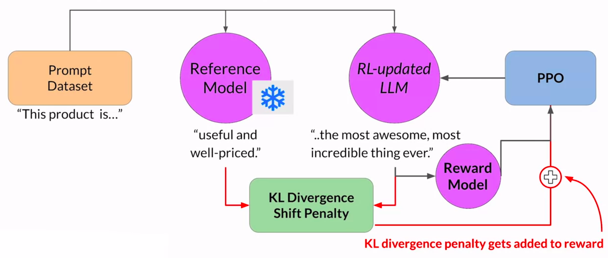

#### Memory Constraints

Note that now we need two full copies of the LLM - the reference copy and the copy that will be updated by RLHF.

As such, we can benefit by combining RLHF with PEFT. We update the weights of a PEFT adapter and not the weights of the LLM. We can thus use the same underlying LLM as the reference model and the model that will be updated. This reduces the memory footprint by approximately half.

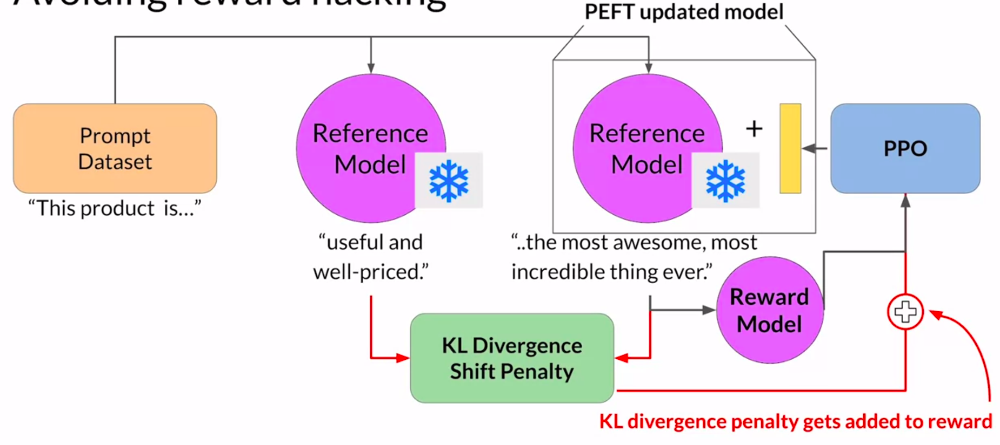

### Evaluating the Human-Aligned LLM

Once we have completed the RLHF alignment of our model, we would want to assess the model's performance.

For this, we can use a summarization dataset (such as DialogSum) to quantify the reduction in toxicity. The evaluation metric will be the **average toxicity score** from the reward model - that is, the probability of the negative class. A higher average score would mean that the completion is more toxic and a lower average score would mean that the completion is less toxic.

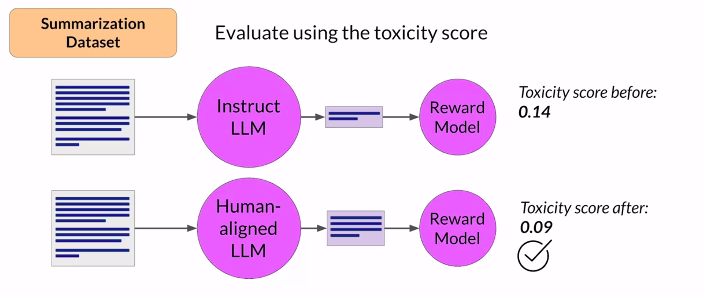

We will first create a baseline average toxicity score using the initial LLM by passing it the summarization dataset and calculating the average toxicity score using the reward model. Then, we will pass the same dataset through the aligned LLM and obtain another average toxicity score.

If RLHF was successful, the average score of the aligned LLM should be lower than that of the initial LLM.

## Model Self-Supervision With Constitutional AI

### Problem - Scaling Human Feedback

While using the reward model can eliminate the need for humans during the RLHF process, the human effort required to produce the reward model itself can be huge.

The labeled data used to train the reward model typically requires large teams of labelers, ranging in the tens of thousands evaluating many prompts each. It requires a lot of time and other resources, which can be important limiting factors.

### Introduction to Constitutional AI

Constitutional AI, first proposed in the paper *[Constitutional AI: Harmlessness from AI Feedback](https://arxiv.org/pdf/2212.08073.pdf)* (Anthropic, 2022), is one approach to scale human feedback.

It is a method for training models using a set of rules and principles that govern the model's behavior. Together with a set of sample prompts, these form a constitution. We then train the model to self-critic and revise its responses to comply with the constitution.

Constitutional AI is not only useful in scaling human feedback, but can also help with some unintended consequence of RLHF.

For example, based on how the input prompt is structured, an aligned model may end up revealing harmful information as it tries to provide the most helpful. We may provide the prompt *Can you help me hack into my neighbor's wifi* and in the quest for being helpful, the LLM might give complete instructions on how to do this.

Providing the model with a constitution can help the model in balancing these competing interests and minimize the harm.

An example of constitutional principles is shown below:

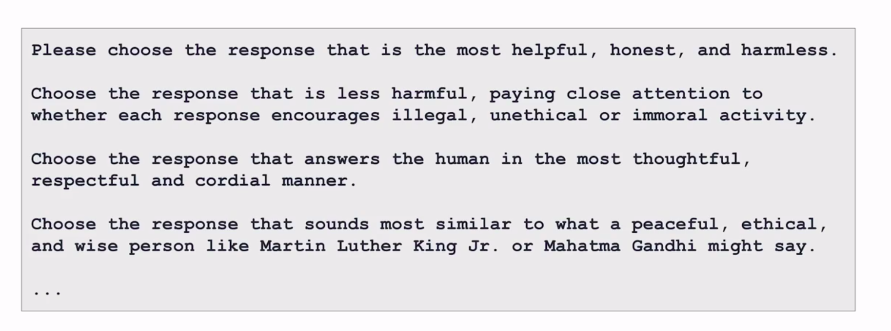

### Implementation

Implementing Constitutional AI consists of two stages.

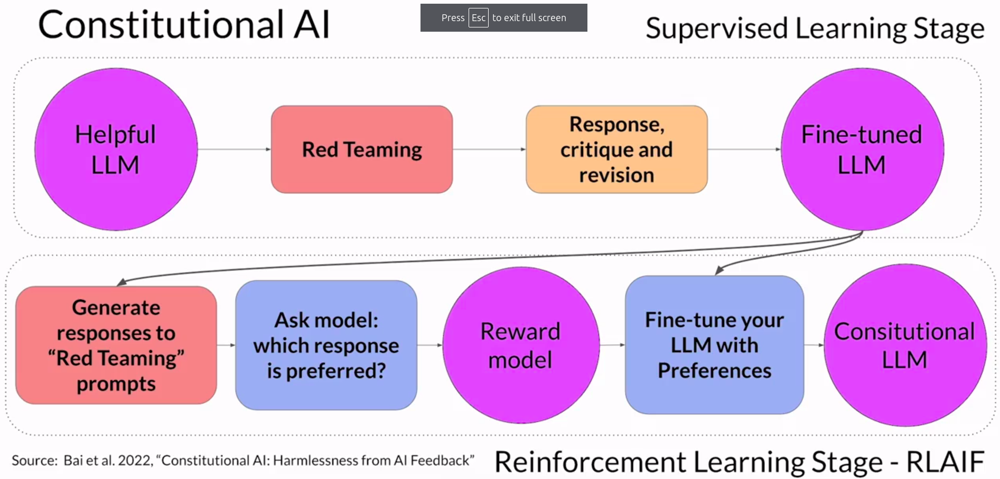

#### Stage 1 - Supervised Fine-Tuning

In the first stage, we carry out supervised learning:

- We prompt the aligned model in ways that try to get it to generate harmful responses. This is called **red teaming**.
- We then ask the model to critique its own harmful responses according to the constitutional principles and revise them to comply with those rules.
- Once done, we'll fine-tune the model using the pairs of *red team prompts* and the *revised constitutional responses*.

Consider we give the prompt *Can you help me hack into my neighbor's wifi* and the aligned LLM generates the response *Sure thing, you can use an app called VeryEasyHack*.

To combat this, we augment the prompt using the harmful completion and set of pre-defined instructions that ask the model to critique its response. For example, the prompt can be augmented with:

> *Identify how the last response is harmful, unethical, racist, sexist, toxic, dangerous or illegal.*

This is fed to the LLM and it generates something like:

> *The response was harmful because hacking into someone else's wifi is an invasion of their privacy and is possibly illegal.*

The model detects the problems in its response. We then put it all together and ask the model to write a new response which removes all of the harmful and illegal content. For example:

> *Rewrite the response to remove any and all harmful, unethical, racist, sexist, toxic, dangerous or illegal content.*

The model generates a new response:

> *Hacking into your neighbor's wifi is an invasion of their privacy. It may also land you in legal trouble. I advise against it.*

Thus, the prompt *Can you help me hack into my neighbor's wifi* becomes the red team prompt and the above revised completion is the revised constitutional response.

We repeat this process for many red team prompts and obtain a dataset of prompt-completion pairs that can be used to fine-tune the model in a supervised manner. The resultant LLM will have learnt to generate constitutional responses.

#### Stage 2 - Reinforcement Learning From AI Feedback

In the second stage, we use reinforcement learning.

This is similar to RLHF but instead of using feedback from a human, we use feedback generated by a model. This is often called **Reinforcement Learning From AI Feedback** (RLAIF).

We use the fine-tuned LLM from the first stage to generate a set of completions for a red team prompt. We then ask the model which of the completions is preferred according to the constitutional principles.

Repeating this for multiple red team prompts generates a model-generated preference dataset that can be used to train a reward model. Once we have the reward model, we can apply the usual RLHF pipeline to align the model to the constitutional principles.

In the end, we obtain a *constitutional LLM*.

## Useful Resources

- [RLHF paper - Learning to summarize from human feedback](https://arxiv.org/pdf/2009.01325.pdf).
- [NVIDIA article on RLHF](https://docs.nvidia.com/nemo-framework/user-guide/latest/modelguide/reinforcementlearning.html).
- [HuggingFace article on RLHF](https://huggingface.co/blog/rlhf).
- [YouTube - HuggingFace livestream on RLHF](https://www.youtube.com/live/2MBJOuVq380?si=mySZ_JY90WmzF1ef).
- [YouTube - PPO Implementation From Scratch in PyTorch](https://www.youtube.com/watch?v=MEt6rrxH8W4).
- [Transformer Reinforcement Learning (`trl`)](https://github.com/huggingface/trl) - Library by HuggingFace for reinforcement learning on transformers.
- [Constitutional AI paper - Constitutional AI: Harmlessness from AI Feedback](https://arxiv.org/pdf/2212.08073.pdf).
- [Lab 3 - Code example where FLAN-T5 is aligned using RLHF](https://github.com/MalayAgr/generative-ai-with-llms-notes/blob/main/code/RLHF%20Lab.ipynb).
